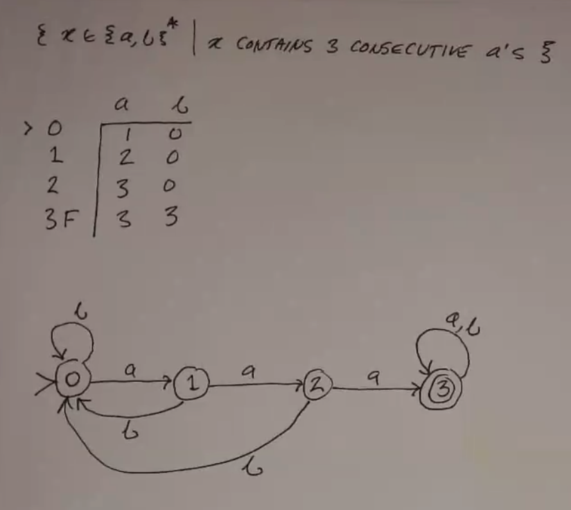
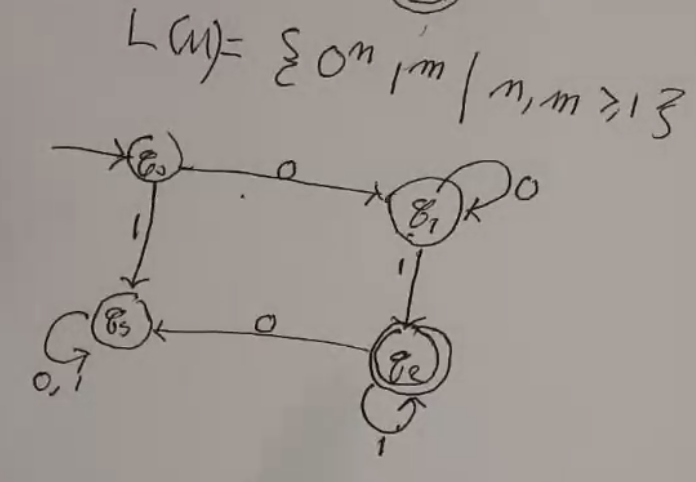
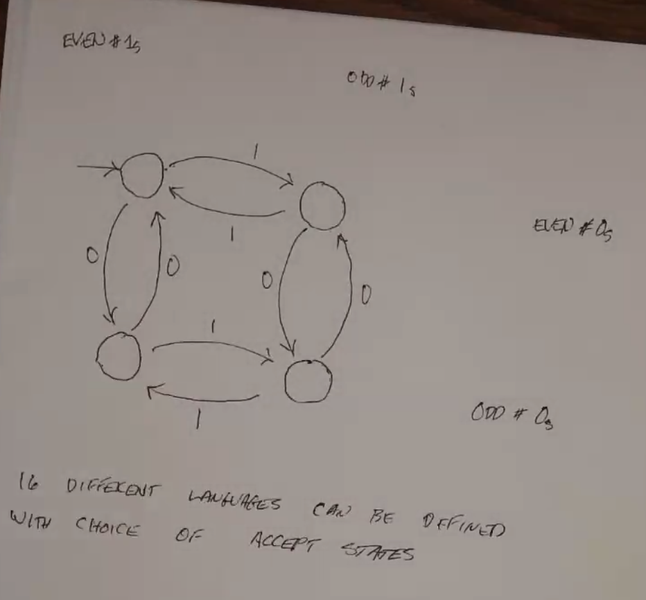

DFA
===

Deterministic Finite Automaton (DFA) is a structure:

:math:`M = (Q, \Sigma, \delta, s, F)`, where:

- :math:`Q` is a finite set of states
- :math:`\Sigma` is a finite set of symbols (input alphabet)
- :math:`\delta: Q \times \Sigma \to Q` is the transition function
    - given a current state and input, use delta to find the new state
- :math:`s = q_0 \in Q` is the start state
- :math:`F \subseteq Q` are the accept/final states

Defns:

- :math:`x \in \Sigma^*` if *accepted* by M if M stops in F
- :math:`L(M)` is the *language of machine M* when it consists of all strings the machine accepts
- :math:`L \subseteq \Sigma^*` is *regular* if there is a DFA M s.t. :math:`L = L(M)` (some dfa recognizes it)

DFAs can be represented using a graph/flowchart thing. Final states are represented by double-bordered nodes.

.. note::
    An example of a non-regular language is :math:`\{0^m1^m | m \geq 1\}`. (e.g. 01, 0011, 000111, etc)

.. note::
    Any finite language is regular, since it can be represented by just a really huge DFA!

Extended Transition Function
----------------------------

:math:`\hat{\delta}: Q \times \Sigma^* \to Q`

Rather than a transition from one state to the next given a symbol, this function maps a starting state and a string to 
the result after processing what whole string.

**Inductice Defn**

- For all :math:`q \in Q, x \in \Sigma^*, a \in \Sigma`:
- :math:`\hat{\delta}(q, \epsilon) = q`
    - the extended transition function of any state and the empty string is the same state
- :math:`\hat{\delta}(q, xa) = \delta(\hat{\delta}(q, x), a)`
    - just the normal transition plus one more

Thms
----

- Given a regular language, the complement of that language is also regular. (let the accept states of the DFA be the rejects of the regular language.)
    - :math:`x \in L(M) \to \hat{\delta}(s, x) \notin F`
    - :math:`\hat{\delta}(s, x) \in Q - F = F_c`
    - :math:`\hat{\delta}(s, x) \in F_c`
    - :math:`x \in L(M_c)`

Examples
--------

Two Ones
^^^^^^^^
This image shows a DFA that accepts any string starting with two ones.

.. image:: _static/dfa1.png
    :width: 350

Even Ones
^^^^^^^^^
Consider a DFA that accepts any string with an even number of ones. (:math:`\Sigma = \{0, 1\}`)

.. image:: _static/dfa2.png
    :width: 350

3 As
^^^^
Consider a DFA that accepts any string that contains at least 3 As. (:math:`\Sigma = \{a, b\}`)

.. image:: _static/dfa3.png
    :width: 350

3 Consec As
^^^^^^^^^^^
Consider a DFA that accepts any string that contains at least 3 *consecutive* As. (:math:`\Sigma = \{a, b\}`)

0m0
^^^
Design a DFA for the language :math:`L(M) = \{01^n0 | n \geq 0\}`.

.. image:: _static/dfa5.png
    :width: 350

00011
^^^^^
Design a DFA for the language :math:`L(M) = \{0^n1^m | n, m \geq 1\}`.

.. note::
    However, :math:`L(M) = \{0^n1^n | n \geq 1\}` does not exist. Such a DFA would have to be infinitely large:

    .. image:: _static/dfa7.png
        :width: 350

Odds/Evens
^^^^^^^^^^
This DFA tracks how many 1s and 0s are found in a string. 16 different languages can be defined with choices of accept
states:

Div3
^^^^
Design a DFA for the language of all binary numbers that are divisible by 3

.. image:: _static/dfa9.png
    :width: 350

Len3
^^^^
Strings of length multiple of 3.

.. image:: _static/dfa10.png
    :width: 350