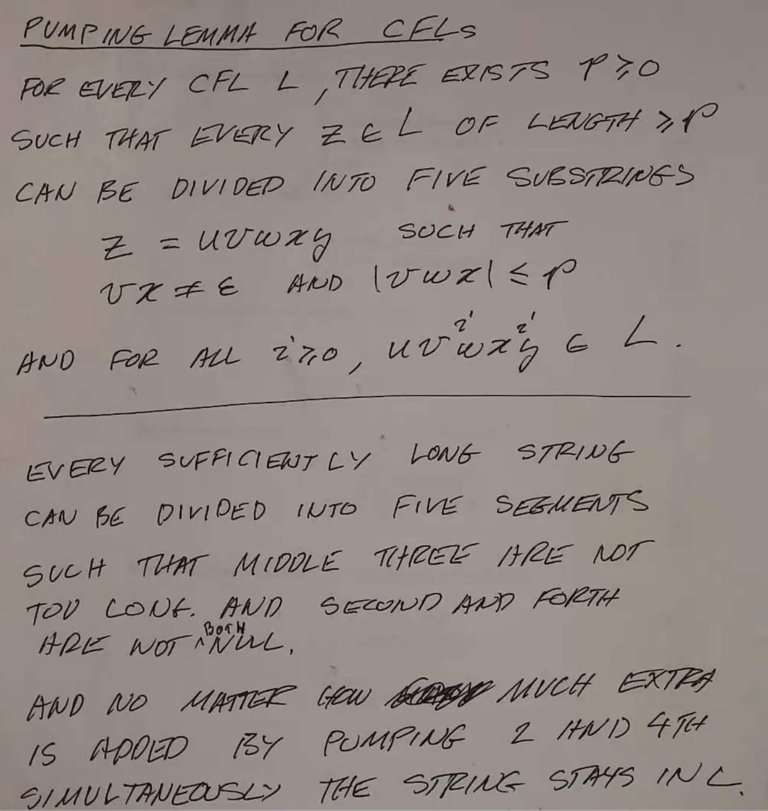

Context-Free Languages
======================
CFLs are more powerful than regular languages! You can use them to do things like balance parens.

Ex. palindromes, :math:`0^n1^n`, balanced parens, etc.

**Context-Free Grammars**

CFGs are used to generate CFLs.

Definition
----------
:math:`G = (N, \Sigma, P, S)`

.. note::
    N ("nonterminals") is sometimes V ("variables"), and P ("productions") is sometimes R ("rules")

- :math:`N` is a finite set (nonterminal symbols/variables)
- :math:`\Sigma` is a finite set (terminal symbols, disjoint from N)
    - :math:`N \cap \Sigma = \emptyset`
- :math:`P` is a finite subset of :math:`N \times (N \cup \Sigma)^*` (productions)
- :math:`S \in N` is the start symbol/variable

Convention
----------

- :math:`A, B, C...` = nonterminals
- :math:`a, b, c...` = terminals
- :math:`\alpha, \beta, \gamma...` = strings in :math:`(N \cup \Sigma)^*`
- :math:`A \to \alpha` for :math:`(A, \alpha)`
- :math:`A \to \alpha_1, A \to \alpha_2, A \to \alpha_3` = :math:`A \to \alpha_1 | \alpha_2 | \alpha_3`

A grammar can be abbreviated as a list of rules. The nonterminals can be found on the left, the rules are listed,
the terminals are the states on the right that are not on the left, and the start state is the top nonterminal.

Examples
--------

.. note::
    For these examples, :math:`\to` will be expressed as ``:=`` and :math:`\epsilon` as ``e``.

Ex 1
^^^^

:math:`a^nb^n`

Formally:

- :math:`G = (N, \Sigma, P, S)`
- :math:`N = \{S\}`
- :math:`\Sigma = \{a, b\}`
- :math:`P = \{S \to aSb, S \to \epsilon\}`
- :math:`S = S`

Abbreviated:

.. code-block:: text

    S := a S b | e

Ex. :math:`a^3b^3` can be ``S := aSb := aaSbb := aaaSbbb := aaabbb``.

Ex 2
^^^^
Even length palindromes.

.. code-block:: text

    S := a S a | b S b | e

Ex. ``aabbaa`` can be ``S := aSa := aaSaa := aabSbaa := aabbaa``.

Ex 3
^^^^
Odd length palindromes.

.. code-block:: text

    S := a S a | b S b | a | b

Ex. ``aababaa`` can be ``S := aSa := aaSaa := aabSbaa := aababaa``.

Ex 4
^^^^
The set of strings over ``{a, b}`` such that the reversal of a string is the string with a's and b's swapped

.. code-block:: text

    S := a S b | b S a | e

Ex 5
^^^^
The set of even length strings

.. code-block:: text

    S := a T | b T | e
    T := a S | b S

    OR

    S := aaS | abS | baS | bbS | e

Ex 6
^^^^
Even length with two middle symbols the same

.. code-block:: text

    S := a S a | a S b | b S a | b S b | aa | bb

Ex 7
^^^^
Odd length with first, middle, and last symbols the same

.. code-block:: text

    S := a T a | b U b
    T := a T a | a T b | b T a | b T b | a
    U := a U a | a U b | b U a | b U b | b

Ex 8
^^^^
Equal number of a's and b's

.. code-block:: text

    S := a S b | b S a | S S | e

Ex 9
^^^^
Palindromes

.. code-block:: text

    S := a S a | b S b | a | b | e

Ex 10
^^^^^
Balanced parentheses

.. code-block:: text

    S := ( S ) | S S | e

Ex 11
^^^^^
:math:`\{0, 1\}^*`

.. code-block:: text

    S := 0 S | 1 S | e

Special Constructions
---------------------

- Right Linear
    - ``A := x B | x`` where :math:`x \in \Sigma^*`
- Strongly Right Linear
    - ``A := x B | e`` where :math:`x \in \Sigma`
- Left/Strongly Left Linear are similar.
    - All the linear constructions generate the regular languages!

DFA Relation
^^^^^^^^^^^^
Since the linear constructions generate the regular languages, they must have an associated DFA:

:math:`M = (Q, \Sigma, \delta, s, F)`

- Make a variable for each state: :math:`V = \{V_i | q_i \in Q\}`
- :math:`\Sigma = \Sigma`
- For each :math:`\delta(q_i, a) \to q_j` where :math:`a \in \Sigma`:
    - make a rule :math:`V_i \to a V_j`
- For each :math:`q_i \in F`:
    - make a rule :math:`V_i \to \epsilon`
- :math:`S = V_0`

**Ex.** Use this method on the language of an odd number of 0s, even number of 1s.

.. image:: _static/cfg1.png
    :width: 350

.. code-block:: text

    V1 := 0 V2 | 1 V4
    V2 := 0 V1 | 1 V3 | e
    V3 := 0 V4 | 1 V2
    V4 := 0 V3 | 1 V1

Closure
-------

Given:

- :math:`G_1 = (N_1, \Sigma, P_1, S_1)`
- :math:`G_2 = (N_2, \Sigma, P_2, S_2)`

Union
^^^^^

- :math:`G = (N, \Sigma, P, S)`
- :math:`N = N_1 \cup N_2 \cup \{S\}`
- :math:`P = P_1 \cup P_2 \cup \{S \to S_1, S \to S_2\}`
- :math:`S = S`

Concatenation
^^^^^^^^^^^^^
- :math:`G = (N, \Sigma, P, S)`
- :math:`N = N_1 \cup N_2 \cup \{S\}`
- :math:`P = P_1 \cup P_2 \cup \{S \to S_1 S_2\}`
- :math:`S = S`

Kleene Star
^^^^^^^^^^^
(Examining :math:`G_1^*`)

- :math:`G = (N, \Sigma, P, S)`
- :math:`N = N_1 \cup \{S\}`
- :math:`P = P_1 \cup \{S \to \epsilon, S \to S_1S\}`
- :math:`S = S`

Intersection (Not)
^^^^^^^^^^^^^^^^^^
CFLs are *not* closed under intersection! Counterexample:

- :math:`a^nb^nc^n` is not a CFL
- :math:`\{a^mb^mc^n | m,n \geq 0\}` is a CFL
    - Pf: See CFG 1 below
- :math:`\{a^mb^nc^n | m,n \geq 0\}` is a CFL
    - Pf: See CFG 2 below
- :math:`\{a^mb^nc^n | m,n \geq 0\} \cap \{a^mb^mc^n | m,n \geq 0\} = a^nb^nc^n` which is not a CFL.

.. code-block:: text

    CFG 1
    S := A B
    A := a A b | e
    B := c B   | e

    CFG 2
    S := A B
    A := a A   | e
    B := b B c | e

Chomsky Normal Form
-------------------
A special form where all rules are of the form ``A := BC | a`` (where :math:`A, B, C \in N` and :math:`a \in \Sigma`).

**Thm**. For any CFG G, there is a CFG G' in CNF s.t. :math:`L(G')=L(G) - \epsilon`.

Converting to CNF
^^^^^^^^^^^^^^^^^

Step 1: Get rid of epsilon-rules and unit-rules

.. image:: _static/cfg2.png
    :width: 750

Step 2: Make everything either go to one terminal or multiple nonterminals

.. image:: _static/cfg3.png
    :width: 750

Step 3: Make every run of 2+ nonterminals just 2 nonterminals.

.. image:: _static/cfg4.png
    :width: 750

**Ex**.

:math:`L = \{a^nb^n | n \geq 1\}`

.. code-block:: text

    0.
    S := a S b | e

    1. add S := a b
    S := a S b | e | a b

    2. Remove e-productions
    S := a S b | a b

    3. Give each terminal a nonterminal
    S := a S b | a b
    A := a
    B := b

    4. Replace nonterminals on the right
    S := A S B | A B
    A := a
    B := b

    5. Replace >2 nonterminals
    S  := A S2 | A B
    S2 := S B
    A  := a
    B  := b

**Ex**.

Balanced parentheses.

.. code-block:: text

    0.
    S := ( S ) | S S | e

    1. add S := ( ) and remove epsilon
    S := ( S ) | S S | ( )

    2. make each terminal a nonterminal
    S := A S B | S S | A B
    A := (
    B := )

    3. Replace runs of >2 nonterminals
    S  := A S2 | S S | A B
    S2 := S B
    A  := (
    B  := )

A more complex example can be found
`on Canvas <https://canvas.ucsc.edu/courses/36492/files/folder/Handouts?preview=2700149>`_.

Pumping Lemma for CFLs
----------------------
For every CFL L, there exists a :math:`p \geq 0` s.t. every :math:`z \in L` of length :math:`\geq p` can be
divided into *five* substrings :math:`z = uvwxy` such that :math:`vx \neq \epsilon` and :math:`|vwx| \leq p`,
and for all :math:`i \geq 0`, :math:`uv^iwx^iy \in L`.

