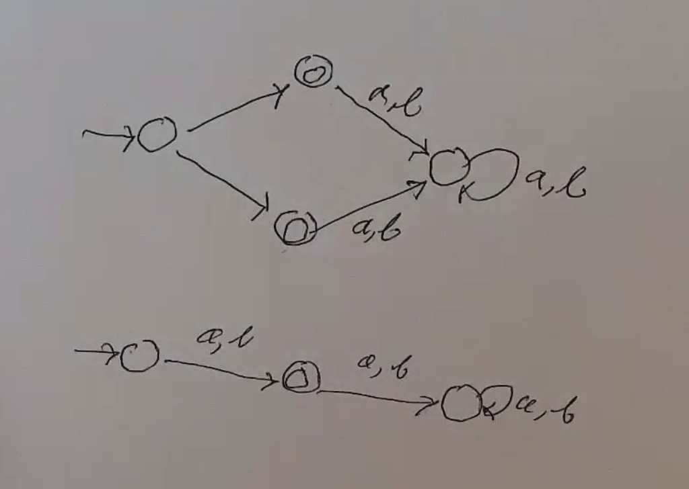
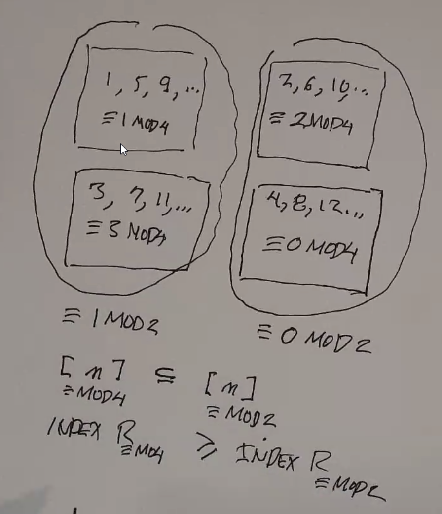

DFA
========

Deterministic Finite Automaton (DFA) is a structure:

:math:`M = (Q, \Sigma, \delta, s, F)`, where:

- :math:`Q` is a finite set of states
- :math:`\Sigma` is a finite set of symbols (input alphabet)
- :math:`\delta: Q \times \Sigma \to Q` is the transition function
    - given a current state and input, use delta to find the new state
- :math:`s = q_0 \in Q` is the start state
- :math:`F \subseteq Q` are the accept/final states

Defns:

- :math:`x \in \Sigma^*` if *accepted* by M if M stops in F
- :math:`L(M)` is the *language of machine M* when it consists of all strings the machine accepts
- :math:`L \subseteq \Sigma^*` is *regular* if there is a DFA M s.t. :math:`L = L(M)` (some dfa recognizes it)

DFAs can be represented using a graph/flowchart thing. Final states are represented by double-bordered nodes.

.. note::
    An example of a non-regular language is :math:`\{0^m1^m | m \geq 1\}`. (e.g. 01, 0011, 000111, etc)

.. note::
    Any finite language is regular, since it can be represented by just a really huge DFA!

Extended Transition Function
----------------------------

:math:`\hat{\delta}: Q \times \Sigma^* \to Q`

Rather than a transition from one state to the next given a symbol, this function maps a starting state and a string to 
the result after processing what whole string.

**Inductice Defn**

- For all :math:`q \in Q, x \in \Sigma^*, a \in \Sigma`:
- :math:`\hat{\delta}(q, \epsilon) = q`
    - the extended transition function of any state and the empty string is the same state
- :math:`\hat{\delta}(q, xa) = \delta(\hat{\delta}(q, x), a)`
    - just the normal transition plus one more

Thms
----

- Given a regular language, the complement of that language is also regular. (let the accept states of the DFA be the rejects of the regular language.)
    - :math:`x \in L(M) \to \hat{\delta}(s, x) \notin F`
    - :math:`\hat{\delta}(s, x) \in Q - F = F_c`
    - :math:`\hat{\delta}(s, x) \in F_c`
    - :math:`x \in L(M_c)`

Examples
--------

Two Ones
^^^^^^^^
This image shows a DFA that accepts any string starting with two ones.

Even Ones
^^^^^^^^^
Consider a DFA that accepts any string with an even number of ones. (:math:`\Sigma = \{0, 1\}`)

3 As
^^^^
Consider a DFA that accepts any string that contains at least 3 As. (:math:`\Sigma = \{a, b\}`)

3 Consec As
^^^^^^^^^^^
Consider a DFA that accepts any string that contains at least 3 *consecutive* As. (:math:`\Sigma = \{a, b\}`)

.. image:: _static/dfa4.png
    :width: 350

0m0
^^^
Design a DFA for the language :math:`L(M) = \{01^n0 | n \geq 0\}`.

00011
^^^^^
Design a DFA for the language :math:`L(M) = \{0^n1^m | n, m \geq 1\}`.

.. image:: _static/dfa6.png
    :width: 350

.. note::
    However, :math:`L(M) = \{0^n1^n | n \geq 1\}` does not exist. Such a DFA would have to be infinitely large:

    .. image:: _static/dfa7.png
        :width: 350

Odds/Evens
^^^^^^^^^^
This DFA tracks how many 1s and 0s are found in a string. 16 different languages can be defined with choices of accept
states:

.. image:: _static/dfa8.png
    :width: 350

Div3
^^^^
Design a DFA for the language of all binary numbers that are divisible by 3

Len3
^^^^
Strings of length multiple of 3.

Intersection
------------
*aka Product Construction*

**Thm**: If languages A and B are regular, then :math:`A \cap B` is regular.

- there exists :math:`M_1 = (Q_1, \Sigma, \delta_1, s_1, F_1)` with :math:`L(M_1) = A`
- there exists :math:`M_2 = (Q_2, \Sigma, \delta_2, s_2, F_2)` with :math:`L(M_2) = B`
- since A and B are regular, we can build a DFA :math:`M_3` s.t. :math:`L(M_3) = A \cap B`.
- let :math:`M_3 = (Q_3, \Sigma, \delta_3, s_3, F_3)`
- :math:`Q_3 = Q_1 \times Q_2 = \{(p, q) | p \in Q_1, q \in Q_2 \}`
- :math:`F_3 = F_1 \times F_2 = \{(p, q) | p \in F_1, q \in F_2 \}`
- :math:`s_3 = (s_1, s_2)`
- :math:`\delta_3: Q_3 \times \Sigma \to Q_3`
    - :math:`\delta_3((p, q), a) = (\delta_1(p, a), \delta_2(q, a))`
- extended transition function:
    - :math:`\hat{\delta_3}((p, q), \epsilon) = (p, q)`
    - :math:`\hat{\delta_3}((p, q), xa) = \delta_3(\hat{\delta_3}((p, q), x), a)`

**Pf**: :math:`L(M_3) = L(M_1) \cap L(M_2)`

.. image:: _static/dfa11.png
    :width: 500

**Ex**: Given two machines that accept an even number of 0s and odd number of 1s, the intersection can be constructed
as such:

**Ex**: Even number of 1s and form :math:`01^m0`

Note that there is no way into :math:`(p_1, q_0)`.

Union
-----

**Thm**: If languages A and B are regular, then :math:`A \cup B` is regular.

- A is regular :math:`\implies \lnot A` is regular
- B is regular :math:`\implies \lnot B` is regular
- :math:`\lnot A \text{ and } \lnot B` regular :math:`\implies \lnot A \cap \lnot B` regular
- :math:`\lnot A \cap \lnot B` regular implies :math:`\lnot (\lnot A \cap \lnot B)` regular
- :math:`\lnot (\lnot A \cap \lnot B)` regular implies :math:`A \cup B` regular (demorgans).

Minimizing a DFA
----------------
Given a DFA:

1. Remove inaccessible states
2. Collapse equivalent areas

E.g.:

.. image:: _static/dfa15.png
    :width: 500

.. image:: _static/dfa16.png
    :width: 500

Identifying Equivalent States
^^^^^^^^^^^^^^^^^^^^^^^^^^^^^
Do this by identifying all states that cannot be equivalent: two states cannot be equivalent if processing
the same some string at each state brings you to a different acceptance value

.. image:: _static/dfa17.png
    :width: 500

Formally, :math:`p \approx q \text{ iff } \forall x \in \Sigma^* (\hat{\delta}(p, x) \in F \iff \hat{\delta}(q, x) \in F)`

.. image:: _static/dfa18.png
    :width: 500

You can use these equivalence classes to make a quotient automaton:

.. image:: _static/dfa19.png
    :width: 500

Equivalence Relations
^^^^^^^^^^^^^^^^^^^^^

- must be reflexive, symmetric, transitive
- partitions a set into disjoint parts (equivalence classes)
    - if R is an equivalence relation on A, :math:`[x]_R = \{ y | x\ R\ y \}`
- given :math:`[x]_R` and :math:`[y]_R`, they are either the same or disjoint
- the union of all equivalence classes of a set is the set
- the *index* of an equivalence relation is the number of equivalence classes

If, for all :math:`x \in A, [x]_1 \subseteq [x]_2` (where 1 and 2 are 2 different relations), then 1 is *finer* than 2.

Therefore, the index of relation 1 will be greater than the index of relation 2.

Myhill-Nerode
^^^^^^^^^^^^^
Idea:

- Let L be any language in :math:`\Sigma^*` (so :math:`L \subseteq \Sigma^*`).
- Let :math:`R_L` be a special equivalence relation on :math:`\Sigma^*`.
- :math:`x\ R_L\ y` iff :math:`\forall z \in L,\ (xz \in L \iff yz \in L)`
    - these two strings are equivalent if regardless of what you append to them, they are both either in the language or not

**Thm**:

Let :math:`L \subseteq \Sigma^*`. Then the following statements are equivalent:

1. L is regular
2. The index of :math:`R_L` is finite

:math:`1 \implies 2` is relatively easy to prove - :math:`2 \implies 1` (shown here) is harder, but we prove it by
constructing a DFA:

.. image:: _static/dfa21.png
    :width: 350

If you can find an infinite sized set of all strings in a language such that no two of them are in the same equivalence
class, then that language is not regular (since the equivalences classes of that set are a subset of equivalence
classes in that language):

.. image:: _static/dfa22.png
    :width: 350

**Ex.**

Prove that :math:`L = \{ 0^n 1^n | n \geq 1 \}` is not regular using M-N:

- Let :math:`S = \{ 0^n | n \geq 1 \}`
- :math:`|S|` is infinite
- Examine :math:`0^i, 0^j \in S` where :math:`i \neq j`
    - By appending :math:`1^i` to both strings, we get one string in the language and another that is not
    - so all items in this set are in different equivalence classes of :math:`R_L`
- So the language is not regular.

**Ex.**

Prove that :math:`L = \{ w \in \Sigma^* | \text{w is a palindrome} \}` is not regular using M-N:

- Let :math:`S = \{ 01, 001, 0001, ... \} = \{ 0^i1 | i \geq 1 \}`
- :math:`|S|` is infinite
- Examine :math:`0^i1, 0^j1 \in S` where :math:`i \neq j`
    - By appending :math:`0^i` to both strings, we get one string in the language and another that is not
    - so all items in this set are in different equivalence classes of :math:`R_L`
- So the language is not regular.

