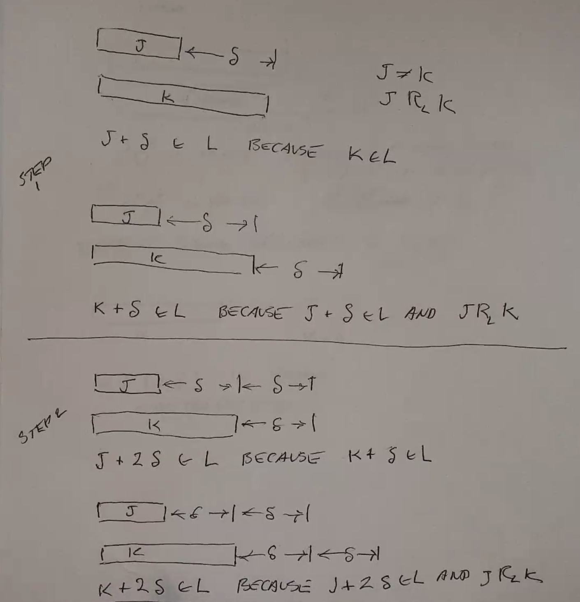

DFAs Extra
==========

Minimizing a DFA
----------------
Given a DFA:

1. Remove inaccessible states
2. Collapse equivalent areas

E.g.:

.. image:: _static/dfa14.png
    :width: 500

.. image:: _static/dfa15.png
    :width: 500

Identifying Equivalent States
^^^^^^^^^^^^^^^^^^^^^^^^^^^^^
Do this by identifying all states that cannot be equivalent: two states cannot be equivalent if processing
the same some string at each state brings you to a different acceptance value

.. image:: _static/dfa17.png
    :width: 500

Formally, :math:`p \approx q \text{ iff } \forall x \in \Sigma^* (\hat{\delta}(p, x) \in F \iff \hat{\delta}(q, x) \in F)`

.. image:: _static/dfa18.png
    :width: 500

You can use these equivalence classes to make a quotient automaton:

Equivalence Relations
^^^^^^^^^^^^^^^^^^^^^

- must be reflexive, symmetric, transitive
- partitions a set into disjoint parts (equivalence classes)
    - if R is an equivalence relation on A, :math:`[x]_R = \{ y | x\ R\ y \}`
- given :math:`[x]_R` and :math:`[y]_R`, they are either the same or disjoint
- the union of all equivalence classes of a set is the set
- the *index* of an equivalence relation is the number of equivalence classes

If, for all :math:`x \in A, [x]_1 \subseteq [x]_2` (where 1 and 2 are 2 different relations), then 1 is *finer* than 2.

Therefore, the index of relation 1 will be greater than the index of relation 2.

.. image:: _static/dfa20.png
    :width: 350

Myhill-Nerode
-------------
Idea:

- Let L be any language in :math:`\Sigma^*` (so :math:`L \subseteq \Sigma^*`).
- Let :math:`R_L` be a special equivalence relation on :math:`\Sigma^*`.
- :math:`x\ R_L\ y` iff :math:`\forall z \in L,\ (xz \in L \iff yz \in L)`
    - these two strings are equivalent if regardless of what you append to them, they are both either in the language or not

**Thm**:

Let :math:`L \subseteq \Sigma^*`. Then the following statements are equivalent:

1. L is regular
2. The index of :math:`R_L` is finite

:math:`1 \implies 2` is relatively easy to prove - :math:`2 \implies 1` (shown here) is harder, but we prove it by
constructing a DFA:

If you can find an infinite sized set of all strings in :math:`\Sigma^*` such that no two of them are in the same
equivalence class, then that language is not regular (since the equivalences classes of that set are a subset of
equivalence classes in that language):

Ex 1
^^^^

Prove that :math:`L = \{ 0^n 1^n | n \geq 1 \}` is not regular using M-N:

- Let :math:`S = \{ 0^n | n \geq 1 \}`
- :math:`|S|` is infinite
- Examine :math:`0^i, 0^j \in S` where :math:`i \neq j`
    - By appending :math:`1^i` to both strings, we get one string in the language and another that is not
    - so all items in this set are in different equivalence classes of :math:`R_L`
- So the language is not regular.

Ex 2
^^^^

Prove that :math:`L = \{ w \in \Sigma^* | \text{w is a palindrome} \}` is not regular using M-N:

- Let :math:`S = \{ 01, 001, 0001, ... \} = \{ 0^i1 | i \geq 1 \}`
- :math:`|S|` is infinite
- Examine :math:`0^i1, 0^j1 \in S` where :math:`i \neq j`
    - By appending :math:`0^i` to both strings, we get one string in the language and another that is not
    - so all items in this set are in different equivalence classes of :math:`R_L`
- So the language is not regular.

Ex 3
^^^^

:math:`L = \{ ww | w \in \Sigma^* \}`

- Let :math:`S = \{ 0^i1 | i \geq 1 \}`
- :math:`|S|` is infinite
- Examine :math:`0^i1, 0^j1` where :math:`i \neq j`
    - By appending :math:`0^i1` to both strings, we get one string in the language and another that is not:
        - :math:`0^i10^i1 \in L`
        - :math:`0^j10^i1 \notin L`
    - so all items in this set are in different equivalence classes of :math:`R_L`
    - so the index of :math:`R_L` is infinite
- So the language is not regular.

Ex 4
^^^^

:math:`L = \{ 1^{m!} | m \geq 1 \}`

- Let :math:`S = L`
- :math:`|S|` is infinite
- Examine :math:`1^{i!}, 1^{j!}` where :math:`i \neq j`
    - By appending :math:`1^{ii!}`, we get:
    - :math:`1^{i!}1^{ii!} = 1^{(i+1)!} \in L`
    - :math:`1^{j!}1^{ii!} = 1^{\frac{j!}{i!}i! + ii!}`
        - :math:`= 1^{i!(\frac{j!}{i!} + i)}`
        - proof by contradiction: assume :math:`i!(\frac{j!}{i!} + i)` is some factorial :math:`q!`
            - :math:`q! = i!(\frac{j!}{i!} + i)`
            - :math:`q(q-1)...(i+1) = \frac{j!}{i!} + i`
            - :math:`= j(j-1)...(i+1)+i`
            - dividing both sides by :math:`i+1`, the remainder on the left is 0 while the remainder on the right is 1
            - so :math:`i!(\frac{j!}{i!} + i)` is not some factorial.
        - so :math:`= 1^{i!(\frac{j!}{i!} + i)} \notin L`
    - so all items in this set are in different equivalence classes of :math:`R_L`
    - so the index of :math:`R_L` is infinite
- so the language is not regular.

Ex 5
^^^^

:math:`L = \{ a^ib^jk^c | i,j,k \geq 0 \land i = 1 \implies j = k \}`

This language cannot be proven irregular using the pumping lemma thm.

- let :math:`S = \{ ab^i | i \geq 1 \}`
- :math:`|S|` is infinite
- Examine :math:`ab^i, ab^j` where :math:`i \neq j`. Append :math:`c^i` to both:
    - :math:`ab^ic^i \in L`
    - :math:`ab^jc^i \notin L`
- so the index of :math:`R_L` is infinite and L is not regular.

Ex 6
^^^^

:math:`L = \{ 0^p | p \text{ is prime}\}`

.. image:: _static/dfaext2.png
    :width: 500

Ex 7
^^^^

:math:`L = \{1^n | n \text{ is even}\}` is regular. Show that the index of :math:`R_L` is finite.

.. note::
    Intuitively, the 2 equivalence classes of :math:`R_L` are the even lengths and the odd lengths.

- All strings in :math:`\Sigma^*` fall into one of two equivalence classes of :math:`R_L`:
- Case 1: Examine :math:`1^jz, 1^kz` where *j* and *k* are even.
    - Case 1: *z* is of even length.
        - The lengths of both strings will be even (sum of 2 even numbers is an even number)
        - so both strings will be in the language.
    - Case 2: *z* is of odd length.
        - The lengths of both strings will be odd (sum of even and odd numbers is an odd number)
        - so both strings will not be in the language.
- Case 2: Examine :math:`1^jz, 1^kz` where *j* and *k* are odd.
    - Case 1: *z* is of even length.
        - The lengths of both strings will be odd (sum of even and odd numbers is an odd number)
        - so both strings will not be in the language.
    - Case 2: *z* is of odd length.
        - The lengths of both strings will be even (sum of 2 odd numbers is an even number)
        - so both strings will be in the language.
- The index of :math:`R_L` is finite, so the language is regular.

Additional Comments
^^^^^^^^^^^^^^^^^^^
Each equivalence class of :math:`R_L` corresponds to a state in the minimal DFA of the language.

Ex: :math:`L = \{w | w \text{ has an even number of 0s and 1s}\}`

Two-Way DFAs
------------
*aka 2dfa*

:math:`M = (Q, \Sigma, \vdash, \dashv, \delta, s, t, r)`

- :math:`Q` = a finite set of states
- :math:`\Sigma` = a finite set (input alphabet)
- :math:`\vdash` = left end marker (:math:`\notin \Sigma`)
- :math:`\dashv` = right end marker (:math:`\notin \Sigma`)
- :math:`\delta: Q \times (\Sigma \cup \{\vdash, \dashv \}) \to (Q \times \{L, R\})`
- :math:`s \in Q` = start state
- :math:`t \in Q` = unique accept state
- :math:`r \in Q` = unique reject state

This makes it possible to accept or reject an input without reading the whole thing, or loop forever.

Note: there are some safety mechanisms in place:

- :math:`\forall q \in Q`, you cannot go off the end of the tape:
    - :math:`\delta(q, \vdash) = (u, R)` for some :math:`u \in Q`
    - :math:`\delta(q, \dashv) = (u, L)` for some :math:`u \in Q`
- :math:`\forall b \in \Sigma \cup \{ \vdash \}`,
    - :math:`\delta(t, b) = (t, R)`
    - :math:`\delta(t, \dashv) = (t, L)`
    - :math:`\delta(r, b) = (t, R)`
    - :math:`\delta(r, \dashv) = (t, L)`
    - once in *t* or *r*, keep moving right.

Example
^^^^^^^

- Scan LtR, counting a's, then RtL counting b's.
- Reject early if encounter right end with invalid num of a's.
- Otherwise make reject/accept decision at left end given number of b's.

Additional Comments
^^^^^^^^^^^^^^^^^^^

Given some boundary on the tape, assuming you cross that boundary at some point again, the state you are in when
you cross the boundary going the opposite direction depends only on tape behind the boundary and the state you crossed
in.

There is also a special symbol for never crossing the boundary again:

.. warning::
    There is a missing image here. Please open a pull request if you have the notes that go here.

This has a relationship with the Myhill-Nerode relationship:

Which proves that this machine has an equal amount of power as a DFA!
