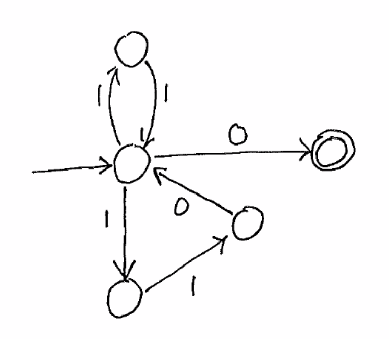

NFA
===

:math:`N = (Q, \Sigma, \delta, s, F)`, where:

- :math:`Q` is a finite set of states
- :math:`\Sigma` is a finite set of symbols (input alphabet)
- :math:`\delta: Q \times \Sigma \to P(Q)` is the transition function
    - the transition function *relation* on :math:`(Q \times \Sigma) \times Q`
    - :math:`\delta(p, a) \in P(Q)`
    - the set of all states N can move to from p in one step under the symbol a
    - :math:`p \to^a q` in :math:`q \in \delta(p, a)`
    - :math:`\delta(p, a)` can be empty set
- :math:`s \in Q` is the start state
- :math:`F \subseteq Q` are the accept/final states

**Extended Transition Function**

- :math:`\delta^*(q, \epsilon) = \{q\}`
- :math:`\delta^*(q, a) = \delta(q, a)`
- :math:`\delta^*(q, xa) = \bigcup_{p \in \delta^*(q, x)} \delta(q, a)`

**Accept**

:math:`w \in \Sigma^*` is accepted if :math:`\delta^*(s, w) \cap F \neq \emptyset`

(a string will be accepted if it's *possible* to accept the string)

.. note::
    It is trivial to prove that every DFA is also a NFA (if the output if the DFA transition is put into a set).

Examples
--------

String ends with 101.

String contains 111.

String contains 001 or 010 or 100 or 11.

NFAs are easier to design.

.. image:: _static/nfa4.png
    :width: 500

as an NFA:

And a weird one:

or

Subset Construction
-------------------
*aka the Rabin-Scott theorem*

Given a NFA :math:`N = (Q_N, \Sigma, \delta_N, s_n, F_n)`, it is possible to construct a DFA:

:math:`M = (Q_D, \Sigma, \delta_D, s_D, F_D)`

- :math:`Q_D = P(Q_N)`
- :math:`s_D = \{s_N\}`
- :math:`F_D = \{P \subseteq Q_N | P \cap F_N \neq \emptyset\}`
- :math:`\delta_D: Q_D \times \Sigma \to Q_D` (i.e. :math:`P(Q_N) \times \Sigma \to P(Q_N)`)
    - :math:`\delta_D(P, a) = \bigcup_{p \in P} \delta_N(p, a)` for :math:`P \subseteq Q_N`

TLDR: the states of the DFA are the sets of states possible at any given point in the NFA.

**Ex.**

Given this language and NFA:

the DFA looks like:

**Ex 2.**

A language of 0s and 1s, where the second-last symbol is a 0.

NFA:

.. image:: _static/nfa9.png
    :width: 500

DFA:

.. image:: _static/nfa10.png
    :width: 500
