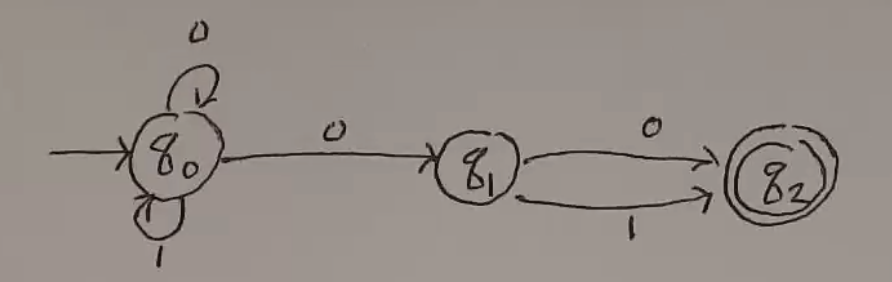

NFA
===

:math:`N = (Q, \Sigma, \delta, s, F)`, where:

- :math:`Q` is a finite set of states
- :math:`\Sigma` is a finite set of symbols (input alphabet)
- :math:`\delta: Q \times \Sigma \to P(Q)` is the transition function
    - the transition function *relation* on :math:`(Q \times \Sigma) \times Q`
    - :math:`\delta(p, a) \in P(Q)`
    - the set of all states N can move to from p in one step under the symbol a
    - :math:`p \to^a q` in :math:`q \in \delta(p, a)`
    - :math:`\delta(p, a)` can be empty set
- :math:`s \in Q` is the start state
- :math:`F \subseteq Q` are the accept/final states

**Extended Transition Function**

- :math:`\delta^*(q, \epsilon) = \{q\}`
- :math:`\delta^*(q, a) = \delta(q, a)`
- :math:`\delta^*(q, xa) = \bigcup_{p \in \delta^*(q, x)} \delta(q, a)`

**Accept**

:math:`w \in \Sigma^*` is accepted if :math:`\delta^*(s, w) \cap F \neq \emptyset`

(a string will be accepted if it's *possible* to accept the string)

.. note::
    It is trivial to prove that every DFA is also a NFA (if the output if the DFA transition is put into a set).

Examples
--------

String ends with 101.

.. image:: _static/nfa1.png
    :width: 350

String contains 111.

.. image:: _static/nfa2.png
    :width: 350

String contains 001 or 010 or 100 or 11.

.. image:: _static/nfa3.png
    :width: 350

NFAs are easier to design.

as an NFA:

.. image:: _static/nfa5.png
    :width: 350

And a weird one:

.. image:: _static/nfa6.png
    :width: 500

or

.. image:: _static/nfa7.png
    :width: 350

Subset Construction
-------------------
*aka the Rabin-Scott theorem*

Given a NFA :math:`N = (Q_N, \Sigma, \delta_N, s_n, F_n)`, it is possible to construct a DFA:

:math:`M = (Q_D, \Sigma, \delta_D, s_D, F_D)`

- :math:`Q_D = P(Q_N)`
- :math:`s_D = \{s_N\}`
- :math:`F_D = \{P \subseteq Q_N | P \cap F_N \neq \emptyset\}`
- :math:`\delta_D: Q_D \times \Sigma \to Q_D` (i.e. :math:`P(Q_N) \times \Sigma \to P(Q_N)`)
    - :math:`\delta_D(P, a) = \bigcup_{p \in P} \delta_N(p, a)` for :math:`P \subseteq Q_N`

TLDR: the states of the DFA are the sets of states possible at any given point in the NFA.

**Ex.**

Given this language and NFA:

.. image:: _static/nfa6.png
    :width: 500

the DFA looks like:

.. image:: _static/nfa8.png
    :width: 500

**Ex 2.**

A language of 0s and 1s, where the second-last symbol is a 0.

NFA:

DFA:

**Ex 3.**

The family of languages :math:`L_n = \{w \in \{0, 1\}^* | \text{ the nth position from end is 1}\}`

The DFA for :math:`L_n` cannot have less than :math:`2^n` states. Pf:

- Assume there is some DFA that recognizes :math:`L_n` that has less than :math:`2^n` states.
- Consider strings of length *n*. There are :math:`2^n` such strings.
- Consider two arbitrary strings *x* and *y* that both end in a state *p*.
- Consider the first position those two strings differ *k*.
- Call the same identical part of the string *u*.
- If we redefine *x* and *y* such that *k* is the start and *u* is moved to the end, we get two strings with different characters *n* from the end, only one of which is accepted
- Contradiction!

Epsilon Moves
-------------
*Epsilon moves* allow us to jump to another state without taking any input.

Consider :math:`L = \{1^n | n \text{ is a multiple of 3 or 5}\}`

.. image:: _static/nfa13.png
    :width: 350

While epsilon moves make NFAs easier to design, any NFA with epsilon moves can be rewritten as one without.

**Formally:**

:math:`M = (Q, \Sigma, \delta, s, F)`, where:

- :math:`\delta: Q \times (\Sigma \cup \{\epsilon\}) \to P(Q)` is the transition function
    - :math:`\delta(q, \epsilon) \to P \subseteq P(Q)` does not move the scan head

**Thm**:

For every :math:`\epsilon`-NFA there is an NFA :math:`\hat{M}` s.t. :math:`L(M) = L(\hat{M})`.

- :math:`\hat{M} = (\hat{Q}, \Sigma, \hat{\delta}, \hat{s}, \hat{F})`, where:
- :math:`\hat{Q} = Q`
- :math:`\hat{s} = s`
- :math:`\hat{\delta}: \hat{Q} \times \Sigma \to P(\hat{Q})`
    - :math:`\hat{\delta}(p, a) = \{q | \text{ there are states } p_1, p_2 \text{ s.t.:}`
        - :math:`p_1 \in E(p)`
        - :math:`p_2 \in \delta(p_1, a)`
        - :math:`q \in E(p_2) \}`
    - where :math:`E(p)` is the set of all states reachable from *p* using only epsilon moves.
- new accept states are states that can reach accept states with epsilon moves

**Ex**:

(cleaner view)

Closure
-------

Regular languages are closed under:

- complement
- union
- intersection
- difference
- concatenation
- kleene star
- quotient
- reversal

Concatenation
^^^^^^^^^^^^^

Kleene Star
^^^^^^^^^^^
The set of all strings that can be generated by concatenating 0 or more strings in a set of strings.

Reversal
^^^^^^^^
Reverse all arrows, make start state accept state, make accept states the start states (using epsilon).

