Parsing
=======

Example: Propositional Logic

- Variable: P, Q, R, ...
- Constants: T/F, 0/1, etc.
- Binary operations: :math:`\land, \lor, \implies, \iff`
- Unary operations: :math:`\lnot`
- Parentheses

.. code-block:: text

    E := ( E B E ) | ( U E ) | C | V
    B := V | ^ | => | <=>
    U := ~
    C := 0 | 1
    V := P | Q | R | ... | Z

Let's parse: :math:`(((P \lor Q) \land R) \lor (Q \land (\lnot P)))`

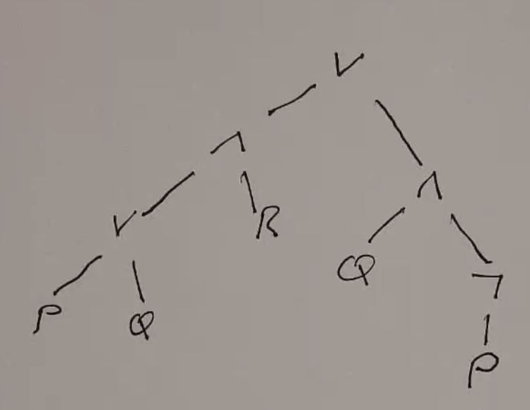

A *simple* parser algorithm (not really robust, or working for other grammars):

- Init stack with :math:`\bot`
- Scan left to right
- If open paren, push
- If operator, push
- If constant, push pointer to it
- If variable, lookup in symbol table, push pointer to it
- If close paren, reduce:
    - Allocate storage for node in expression tree
    - Pop object (ptr to right operand, could be const, var, or another node)
    - Pop object (should be the operator), save in node
    - If operator is binary:
        - Pop object (ptr to left operand)
    - Pop object (should be left paren)
    - Push pointer to new node

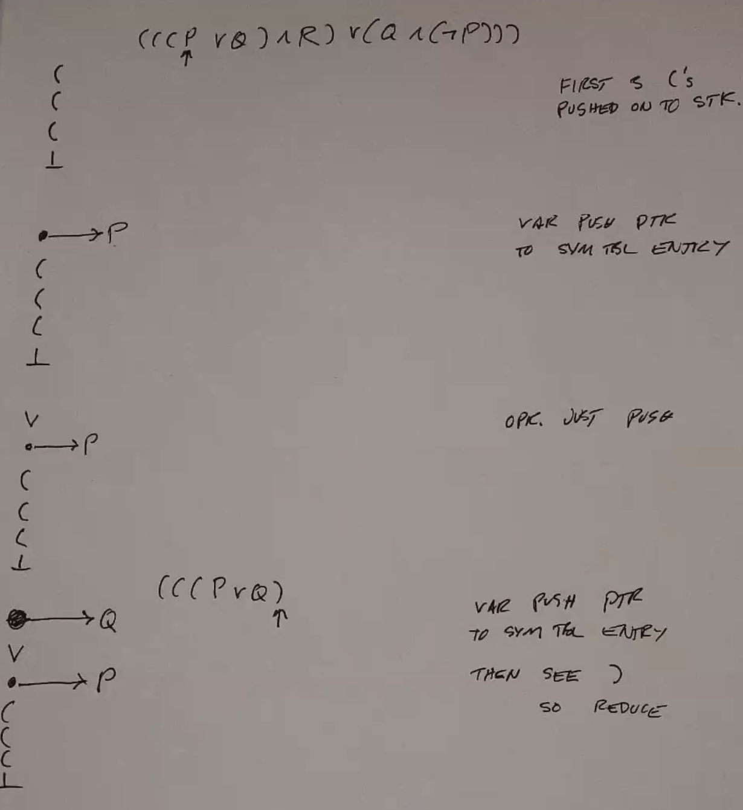

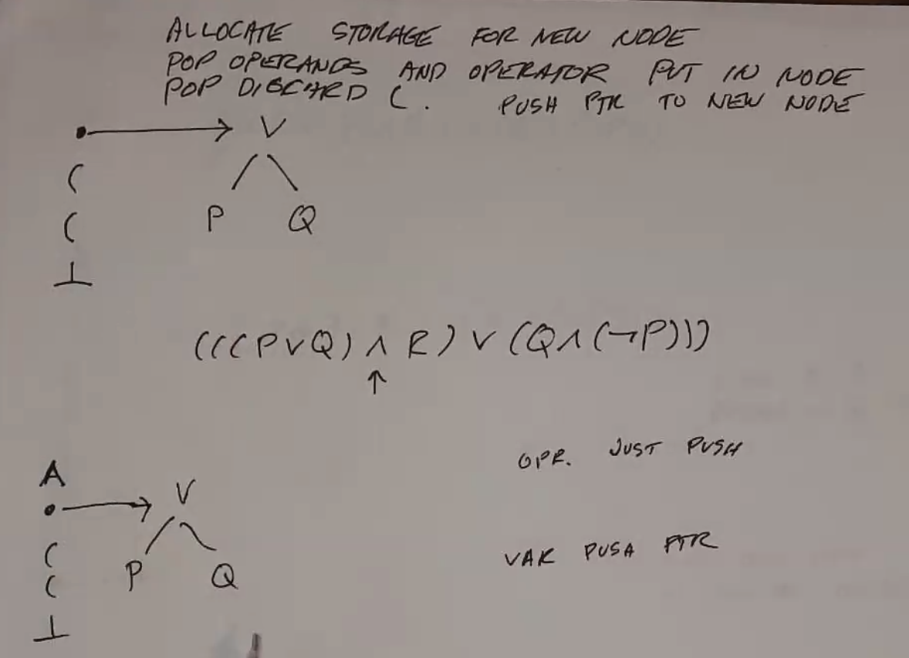

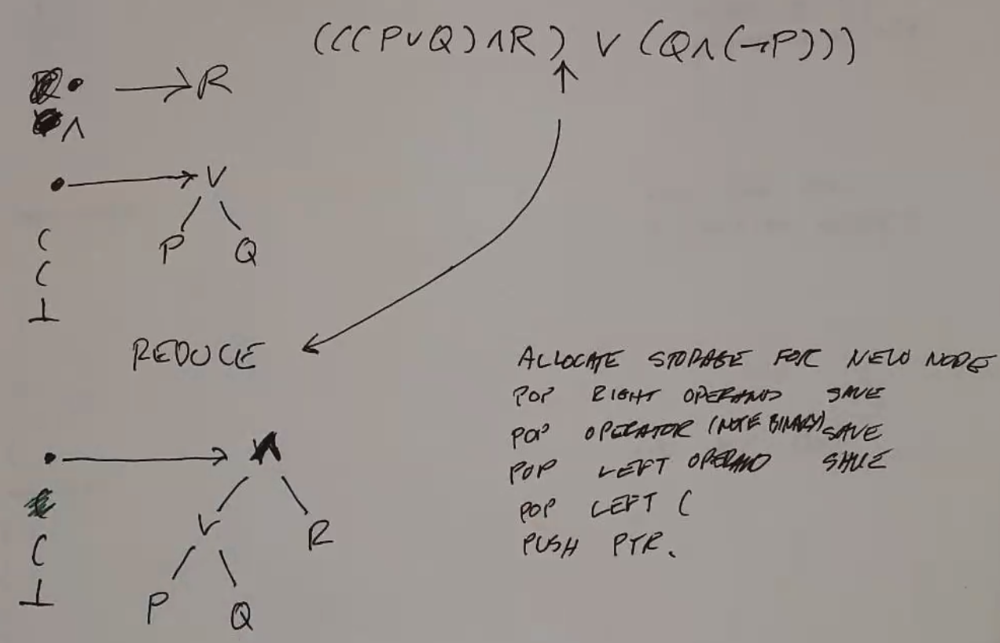

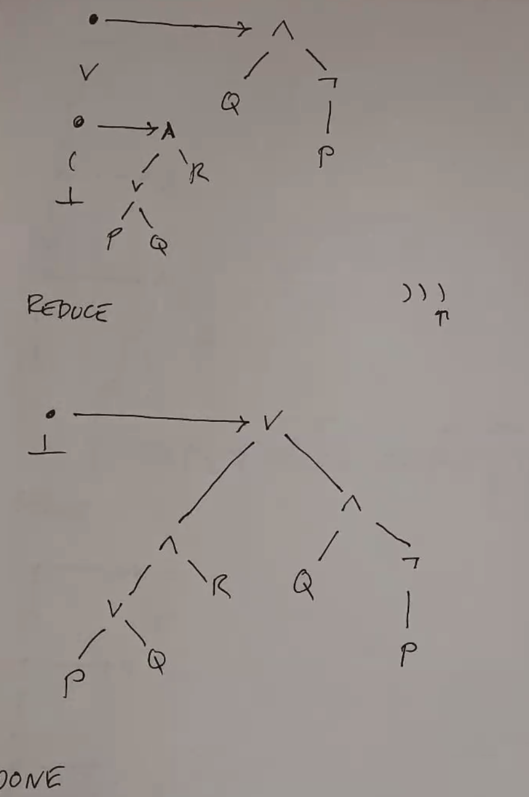

Ambiguity
---------
The above example uses parens everywhere so we don't have to worry about order of ops. What if we don't?

.. code-block:: text

    E := EBE | UE | C | V | (E)
    B := V | ^ | => | <=>
    U := 0 | 1
    V := P | Q | R | ... | Z

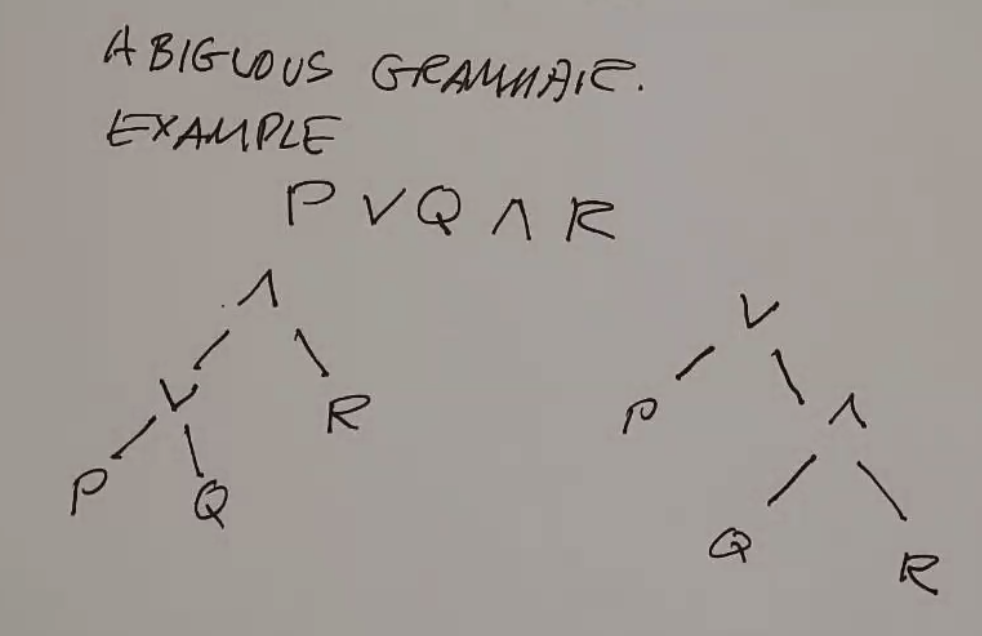

We need to give precedence to some operators. Let's look at a math grammar and apply OoO:

.. code-block:: text

    E := E+E | E-E | E*E | E/E | -E | C | V | (E)
    C := 0 | 1
    V := a | b | c

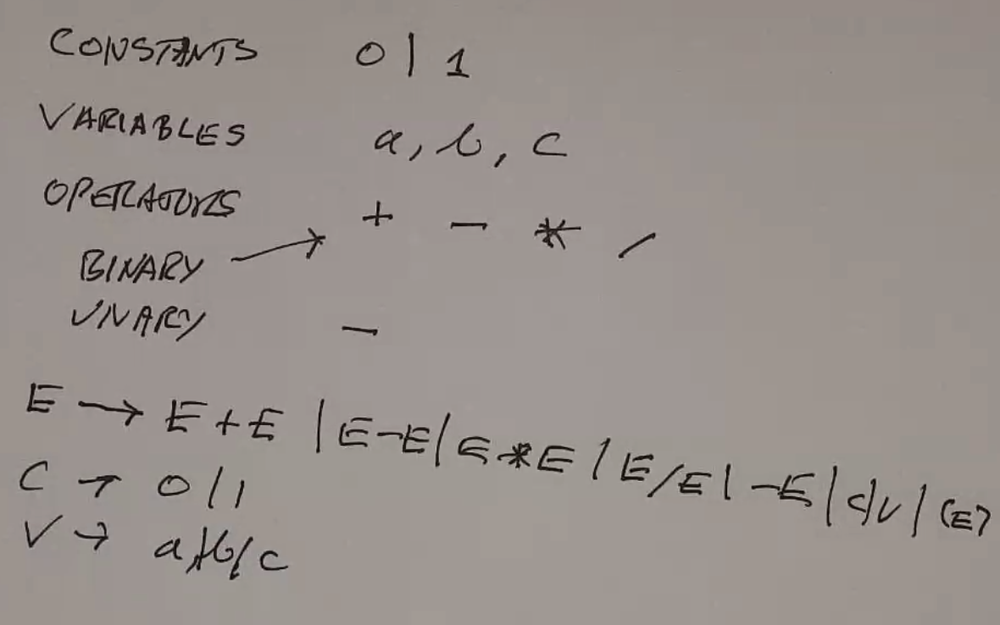

There's a lot of ambiguity without precedence:

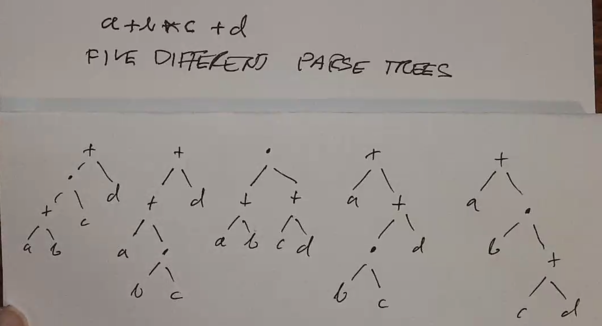

Solution 1: Design
^^^^^^^^^^^^^^^^^^
Design the grammar so that there is no ambiguity.

.. code-block:: text

    E := E+F | E-F | F
    F := F*G | F/G | G
    G := -G | H
    H := C | V | (E)
    C := 0 | 1
    V := a | b | c

This gives the following precedence:

1. unary -
2. ``*``, ``/``
3. ``+``, ``-``
4. ``(``
5. :math:`\bot`

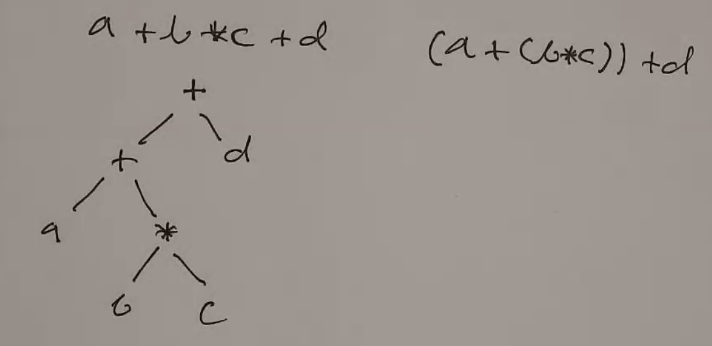

This changes our parsing algorithm to check the operator under the operand on the stack when it reaches an
operator - reduce if it has higher or equal precedence, push if not:

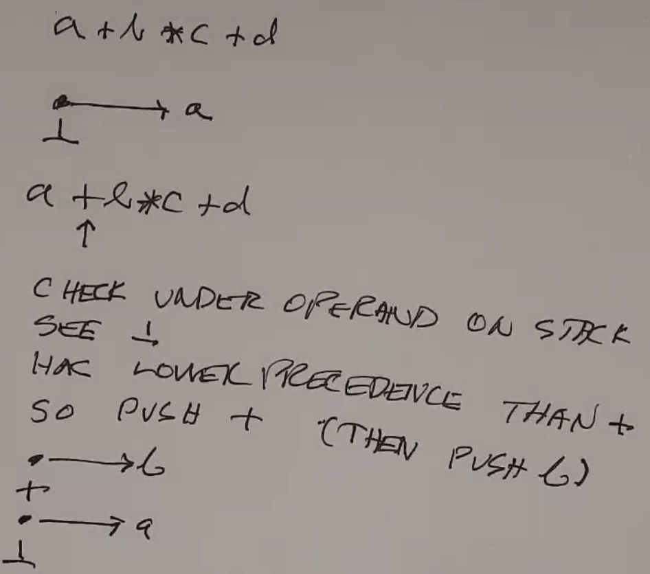

Ok, this screenshot kind of failed, but same thing: push ``*`` then ``c``:

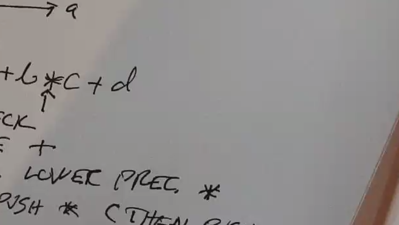

Now, when we parse the next operator, we see that the operator below (``*``) has higher precedence:
so we need to reduce!

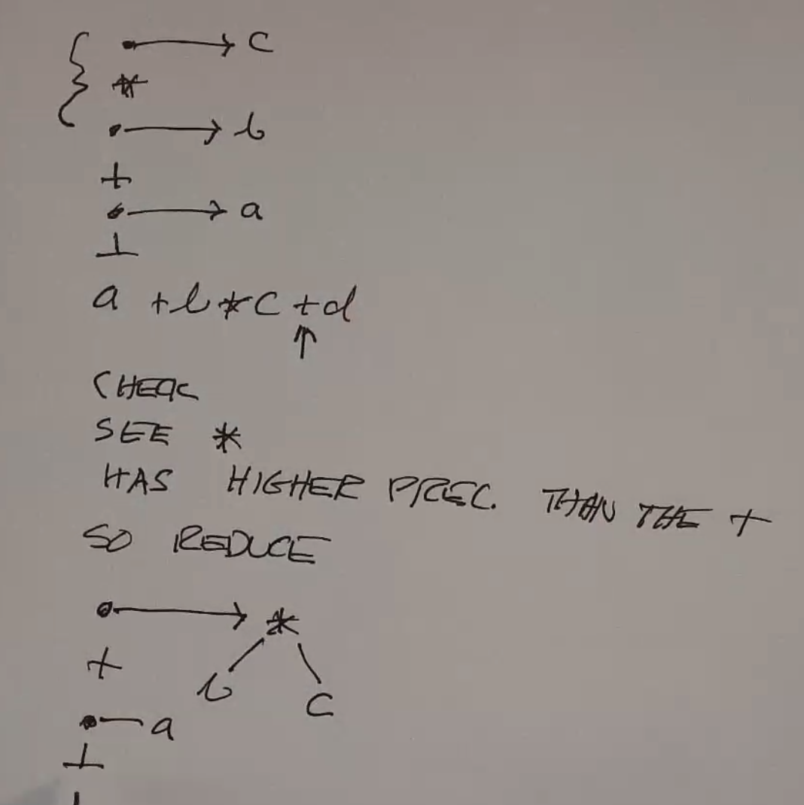

Repeat, now the operand underneath is ``+``, which has equal precedence - so we reduce again
(because we're parsing left to right)

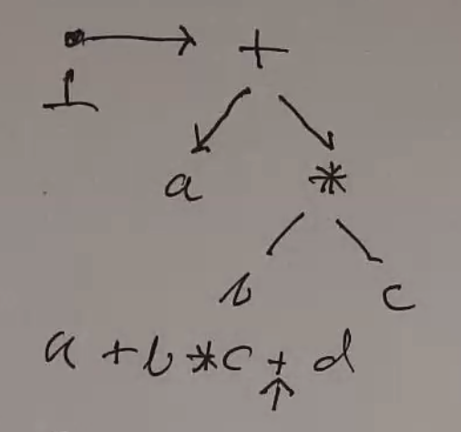

And check again, the bottom of the stack has super low precedence so we're fine. Push.

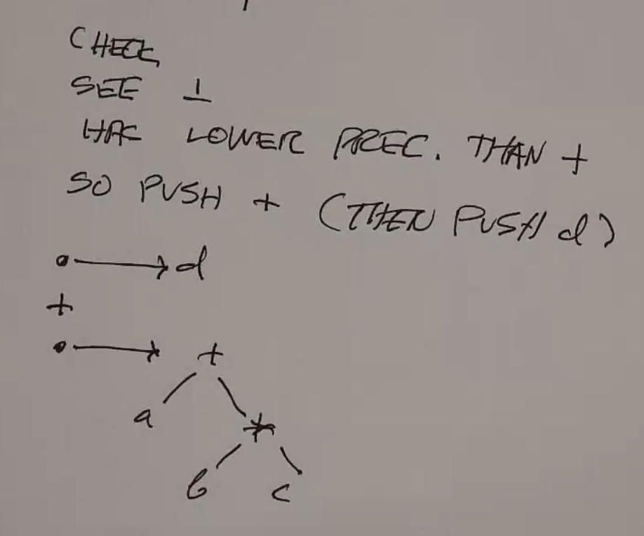

Now we're at the end of the string, so reduce as much as possible (in this case 1 reduce):

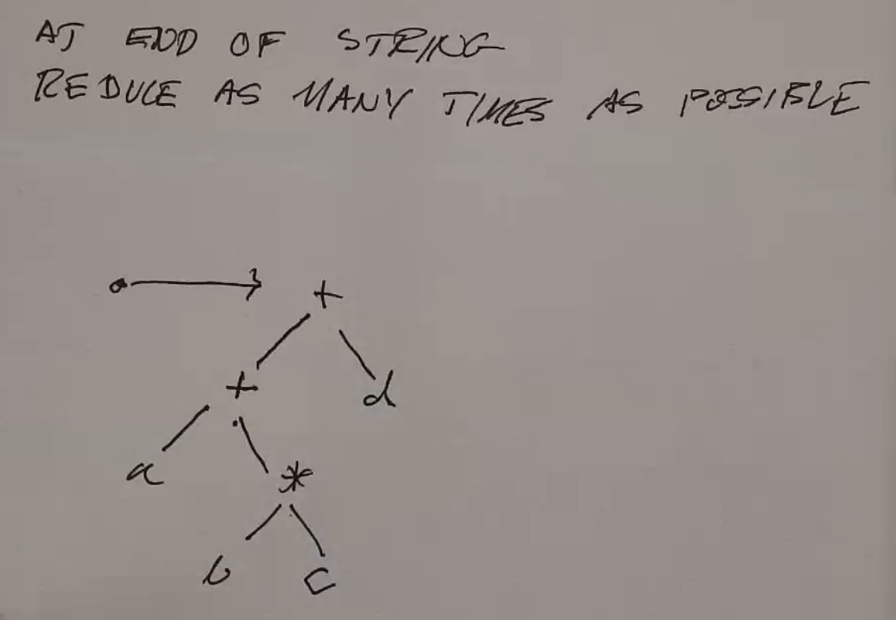

