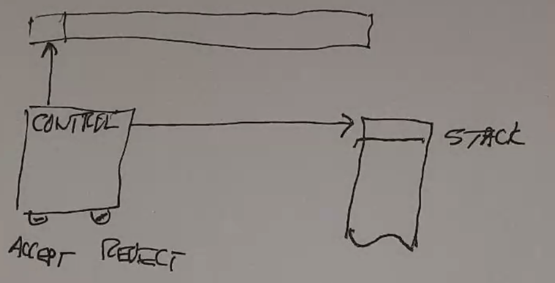
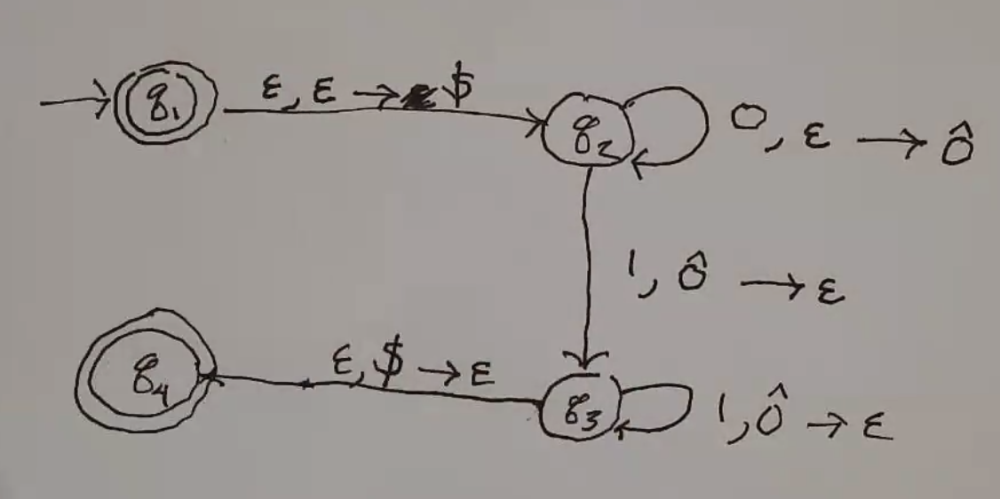
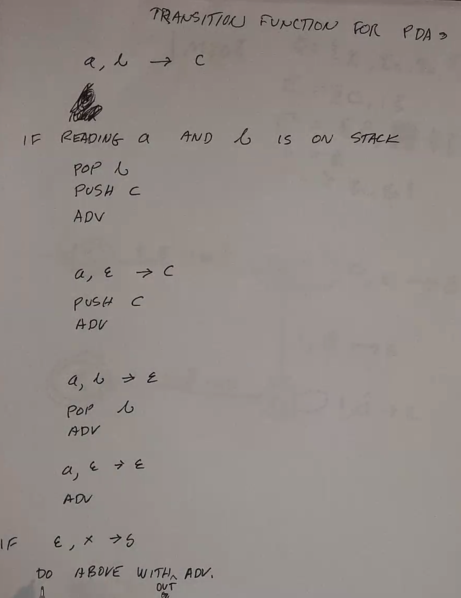
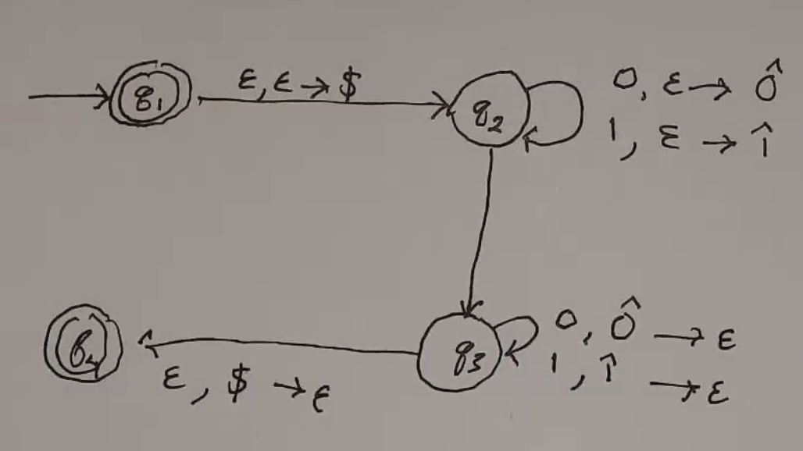
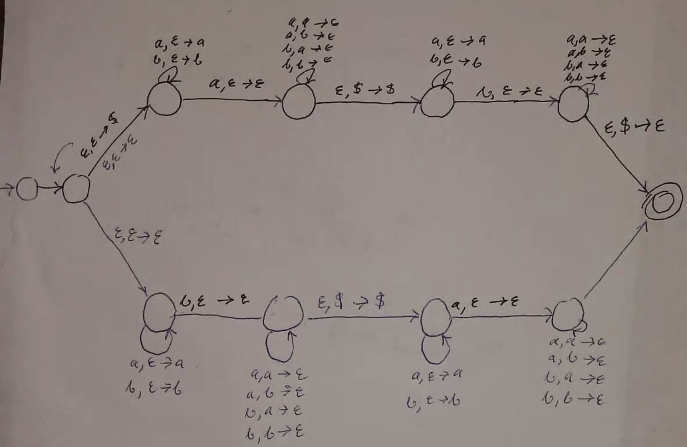
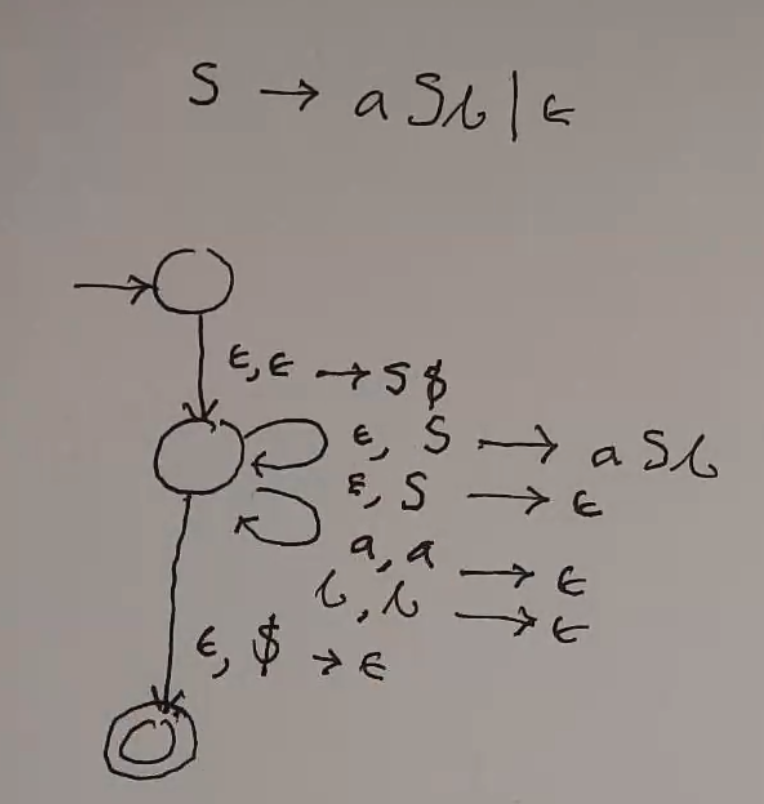
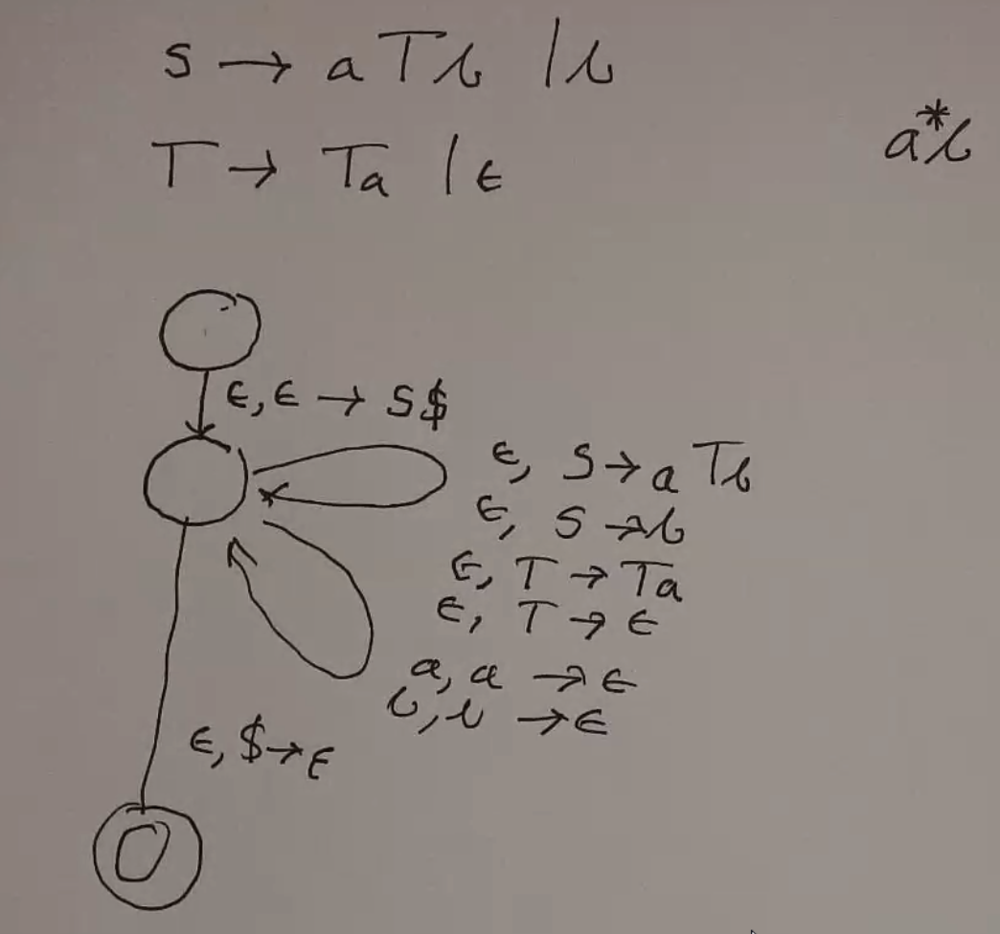

Push-Down Automata
==================
PDAs give us a form of memory by introducing a stack, which has infinite space but containing a finite number of
elements:

Formal Definition
-----------------

:math:`M = (Q, \Sigma, \Gamma, \delta, s, F)` where

- :math:`Q` is a finite set of states
- :math:`\Sigma` is a finite set (symbols - input alphabet)
- :math:`\Gamma` is a finite set (symbols - stack alphabet)
- :math:`\delta: (Q \times (\Sigma \cup \{ \epsilon \}) \times (\Gamma  \cup \{ \epsilon \})) \to P(Q \times (\Gamma  \cup \{ \epsilon \}))`
    - Takes a state, maybe something from the input, maybe something from the stack (popped)
    - Produces some subset of states (non-deterministic) and something to push on stack, optionally
- :math:`s \in Q` is the start state
- :math:`F \subset Q` is the accept states

Ex 1
^^^^

- :math:`L = \{ 0^n 1^n | n \geq 0 \}`
- :math:`Q = \{q_1, q_2, q_3, q_4\}`
- :math:`\Sigma = \{0, 1\}`
- :math:`\Gamma = \{ \hat{0}, $ \}`
- :math:`s = q_1`
- :math:`F = \{ q_1, q_4 \}`
- :math:`\delta` is represented by this state diagram:
- Design: Push 0s onto the stack, pop an equal number of 1s.

:math:`x, y \to z` represents whether to read, what to pop, and what to push, if any.

Ex 2
^^^^

:math:`L = \{ w w^R | w \in \{0, 1\}^* \}`

.. note::
    The transition :math:`q_2 \to q_3` is nondeterministic and can be an epsilon move.

Ex 3
^^^^

The complement of :math:`L = \{ w w | w \in \{0, 1\}^* \}` (see CFG ex. 5)

CFGs
----
You can make a PDA for any CFG using 3 states:

.. code-block:: text

    Place $ and start in stack
    Do repeatedly:
        If var on top:
            Pop it and push right side of rule (*)
        If terminal on top:
            If it matches the stack, advance read head
            If not, fail
        If $ on top:
            Accept

.. note::
    ``*``: This means we allow pushing entire strings onto the stack. This can be done character-wise, but it's
    faster this way.

Ex 1
^^^^

Ex 2
^^^^

CKY Algorithm
-------------
Given a CFG, how do you determine whether :math:`x \in L(G)`?

Examine the substrings (grammar should be in CNF):

Ex 1
^^^^

.. code-block:: text

    S := AB | BA | SS | AC | BD
    A := a
    B := b
    C := SB
    D := SA

Is ``aabbab`` in the language? The table represents ways to get from top to right.
Fill in the diagonals (longest first):

.. code-block:: text

    |a|a|b|b|a|b|
    0 1 2 3 4 5 6

    +-----+-----+-----+-----+-----+-----+---+
    | 0   |     |     |     |     |     |   |
    +-----+-----+-----+-----+-----+-----+---+
    | {A} | 1   |     |     |     |     |   |
    +-----+-----+-----+-----+-----+-----+---+
    | {}  | {A} | 2   |     |     |     |   |
    +-----+-----+-----+-----+-----+-----+---+
    | {}  | {S} | {B} | 3   |     |     |   |
    +-----+-----+-----+-----+-----+-----+---+
    | {S} | {C} | {}  | {B} | 4   |     |   |
    +-----+-----+-----+-----+-----+-----+---+
    | {D} | {S} | {}  | {S} | {A} | 5   |   |
    +-----+-----+-----+-----+-----+-----+---+
    | {S} | {C} | {}  | {C} | {S} | {B} | 6 |
    +-----+-----+-----+-----+-----+-----+---+

Since it is possible to get from 0 to 6 using the start variable, the string is in the language.

Ex 2
^^^^

.. code-block:: text

    S := AB | BC
    A := BA | a
    B := CC | b
    C := AB | a

Is ``baaba`` in the language?

.. code-block:: text

    |b|a|a|b|a|
    0 1 2 3 4 5

    +-----------+--------+--------+--------+--------+---+
    | 0         | b      |        |        |        |   |
    +-----------+--------+--------+--------+--------+---+
    | {B}       | 1      | a      |        |        |   |
    +-----------+--------+--------+--------+--------+---+
    | {A, S}    | {A, C} | 2      | a      |        |   |
    +-----------+--------+--------+--------+--------+---+
    | {}        | {B}    | {A, C} | 3      | b      |   |
    +-----------+--------+--------+--------+--------+---+
    | {}        | {B}    | {S, C} | {B}    | 4      | a |
    +-----------+--------+--------+--------+--------+---+
    | {A, S, C} | {S, A} | {B}    | {A, S} | {A, C} | 5 |
    +-----------+--------+--------+--------+--------+---+

So the string is in the language.

