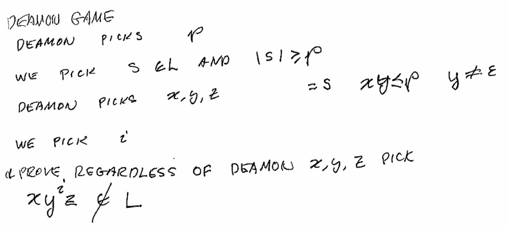
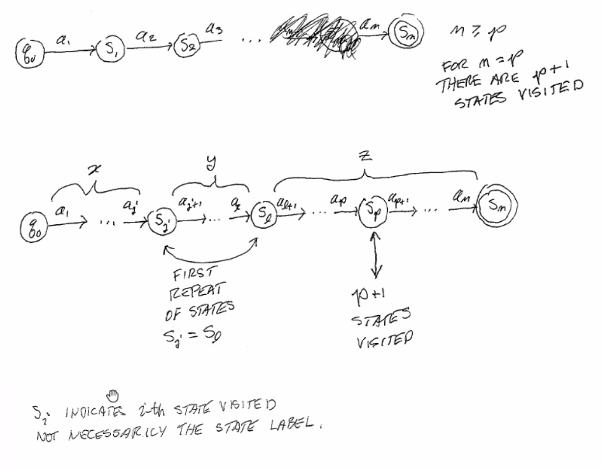

Pumping Lemma
=============

If a language L is regular, then:

**(P)**: There exists a :math:`p \geq 0` s.t. for any string :math:`s \in L` with :math:`|s| \geq p`, there exist
strings :math:`xyz` s.t. :math:`s = xyz, y \neq \epsilon, |xy| \leq p`, and for all :math:`i \geq 0`, the
string :math:`xy^iz \in L`.

"there exists a non-empty string (y) within the first *p* characters (3rd constraint) that can be pumped,
with the resulting string still being in the language."

The contrapositive of this (:math:`\lnot P \implies` L is not regular) is used to prove that a language is not regular.

**(not P)**: For all :math:`p \geq 0` there exists a string :math:`s \in L` with :math:`|s| \geq p`, and for all
:math:`x, y, z` such that :math:`xyz = s, y \neq \epsilon, |xy| \leq p` there exists an :math:`i \geq 0` such that
:math:`xy^iz \notin L`.

You can use this adversarial game to prove the contrapositive:

Proof
-----

Given a DFA with *p* states, processing any string with length :math:`m \geq p` means the machine will visit at least
p + 1 states. By the pigeonhole principle, at least one state will be revisited.

Notice that the string that causes the DFA to go from :math:`s_j` to :math:`s_l` can be repeated infinitely, since
they are a loop.

Examples
--------

Ex 1
^^^^

:math:`A = \{ 0^m1^m | m \geq 0 \}` is not regular.

Use the demon game as a valid proof:

- Demon picks *p*
- we pick :math:`s \in L` and :math:`|s| \geq p`
    - :math:`s = 0^p1^p`
- demon picks partition :math:`x, y, z` s.t. :math:`xyz = s, |xy| \leq p, y \neq \epsilon`
- we show any partition that satisfies these conditions cannot be pumped for some :math:`i \geq 0`
    - since :math:`|xy| \leq p, y \neq \epsilon` and we chose :math:`s = 0^p1^p`, *y* must be one or more 0s
    - choose :math:`i = 2`: this causes :math:`xy^2z` to have more 0s than 1s and not be in the language
    - QED

Ex 2
^^^^

:math:`L = \{ w | \text{ # of 0s = # of 1s} \}` is not regular.

Abbreviated demon argument:

- :math:`p`
- :math:`s = 0^p 1^p`
- for any partition :math:`x, y, z` s.t. :math:`xyz = s, |xy| \leq p, y \neq \epsilon`: (same argument as before)
    - *y* must be made of 1 or more 0s
    - choose :math:`i = 2`: this causes :math:`xy^2z` to have more 0s than 1s and not be in the language
    - QED

Ex 3
^^^^

:math:`L = \{ 1^j 0^i | j < i \}` is not regular

- :math:`p`
- :math:`s = 1^p 0^{p+1}` (conditions: :math:`s \in L, |s| = 2p+1 \geq p`)
- for any partition :math:`x, y, z` s.t. :math:`xyz = s, |xy| \leq p, y \neq \epsilon`:
    - *y* must be made of 1 or more 1s
    - choose :math:`i = 2`: this causes :math:`xy^2z` to have :math:`i \geq j` and not be in the language
    - QED

Ex 4
^^^^
:math:`L = \{ 0^i 1^j | i > j \}` is not regular

- Assume L is regular
- so the reverse of L is regular (closure under reverse)
- The reverse of L is not regular (ex 3)
- so L is not regular. QED.

Ex 5
^^^^

:math:`L = \{ ww | w \in \{0, 1\}* \}` is not regular

- :math:`p`
- :math:`s = 0^p10^p1`
    - :math:`|s| = 2p+2 \geq p, s \in L`
- :math:`xyz = 0^p10^p1` s.t. :math:`|xy| \leq p, |y| > 1`
- if :math:`i = 2`, :math:`xy^2z \notin L`.
    - since then there will be more 0s before the first 1 than before the last one.

Ex 6
^^^^

Palindrones ( :math:`L = \{ w | w = w^R \}` ) are not regular.

- :math:`p`
- :math:`s = 0^p 1 0^p`
    - :math:`|s| = 2p+1 \geq p, s \in L`
- :math:`xyz = 0^p10^p` s.t. :math:`|xy| \leq p, |y| > 1`
    - for any i ≥ 2, the new string of the form :math:`xy^iz` will have more 0s before the 1 than after, and will no longer be in the language.

Ex 7
^^^^
:math:`L = \{0^m1^n | m \neq n \}` is not regular

- :math:`p`
- :math:`s = 0^p1^{p+p!}`
- :math:`xyz = 0^p1^{p+p!}` s.t. :math:`|xy| \leq p, |y| > 1`
    - so *y* must be 1 or more 0s
    - let the length of *y* be *k*, so :math:`xyz = 0^{p-k}0^k1^{p+p!}`
- pick :math:`i = \frac{p!}{k}+1`
    - :math:`|y| = k`, so :math:`|y^i| = ki = k * \frac{p!}{k}+1 = p!+k`
- then :math:`xyz = 0^{p-k}0^{p!+k}1^{p+p!}`
    - :math:`=0^{p+p!}1^{p+p!} \notin L`.

Ex 7b
^^^^^
Alternatively, assume L is regular.

- Then :math:`\lnot L` is regular (closed on complement)
- Then :math:`\lnot L \cap 0^*1^*` is regular (closed on intersection)
- That language is :math:`\{ 0^m1^n | m=n \}`, which is not regular - contradiction!

Ex 8
^^^^
:math:`L = \{ 1^{n^2} | n \geq 0 \}` is not regular

- :math:`p`
- :math:`s = 1^{p^2}`
- :math:`xyz = s` s.t. :math:`|xy| \leq p, |y| > 1`
- let i = 2, then:
    - :math:`|xy^2z| - |xyz| = |y| \leq p`
    - :math:`|xy^2z| \leq p^2+p`
    - :math:`p^2 < |xy^2z| \leq p^2 + p < (p+1)^2`, so :math:`s \notin L`.

Ex 9
^^^^
:math:`L = \{ 0^{2^n} | n \geq 1 \}` is not regular

- :math:`p`
- :math:`s = 0^{2^p}`
- :math:`xyz = s` s.t. :math:`|xy| \leq p, |y| > 1`
    - let :math:`|x| = a, |y| = b, |z| = c, 0 < b \leq p, a+b=p`
- let i = 2, :math:`s' = xy^2z`, then:
    - :math:`|xy^2z| = 2^p+b`
    - :math:`2^p+b \leq 2^p+p`
    - :math:`< 2^p+2^p`
    - :math:`= 2^{p+1}`
    - so :math:`|xy^2z|` is not a power of 2, so :math:`s' \notin L`.

Ex 10
^^^^^
:math:`L = \{ a^{n!} | n \geq 0 \}` is not regular

- :math:`p`
- :math:`s = a^{p!}`
- :math:`xyz = s` s.t. :math:`|xy| \leq p, |y| > 1`
    - let :math:`|x| = j, |y| = m > 0, |z| = n, j+m+n = p!`
- pick *i* s.t. :math:`|xy^iz| \neq q!` for any *q*
    - for any *i*, :math:`|xy^iz| = j+im+n = p!+(i-1)m`
    - pick :math:`i = (p+1)! + 1`, then :math:`|xy^iz| = p! (p+1)! m`
    - :math:`=p!(1+m(p+1))`, prove that this is not a factorial
    - assume :math:`q! = p!(1+m(p+1))`
    - then dividing both sides by :math:`p!`: :math:`q(q-1)(q-2)...(p+2)(p+1) = (1+m(p+1))`
    - impossible because left is divisible by :math:`p+1` and right side leaves remainder of 1.
    - therefore :math:`p!(1+m(p+1))` is not a factorial, so :math:`xy^iz \notin L`.

