Regular Expressions
===================

Regular expressions over alphabet :math:`\Sigma`:

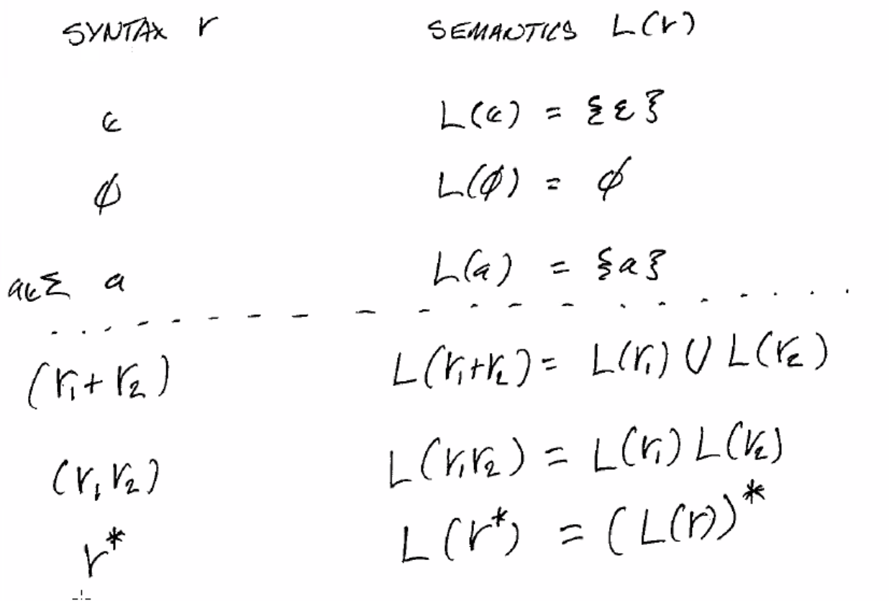

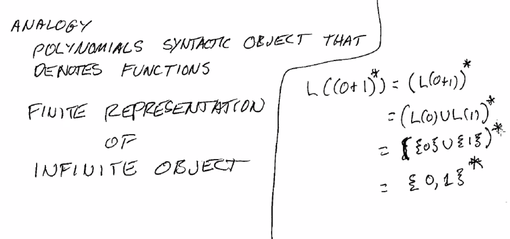

Ex. Begin with 0, end with 11: ``0(0+1)*11``

Ex. Contains at least 2 1s: ``(0+1)* 1 (0+1)* 1 (0+1)*`` or ``0* 1 0* 1 (0+1)*``

.. note::
    ``a+`` is often used as an abbreviation for ``aa*``

Ex. Contains the substring ``111``: ``(0+1)* 111 (0+1)*``

Ex. Even length: ``((0+1)(0+1))*``

Ex. Odd length: ``(0+1)((0+1)(0+1))*``

Ex. Strings that don't end with ``01``: ``e + 1 + (0+1)*0 + (0+1)*11`` - it's hard to exclude things!

Ex. Every 0 is followed by at least one 1: ``1* (011*)*``

Ex. 3rd symbol from right is 1: ``(0+1)* 1 (0+1)(0+1)``

Ex. Contains both 01 and 10. ``((0+1)* 01 (0+1)* 10 (0+1)*) + ((0+1)* 10 (0+1)* 01 (0+1)*)``

Ex. Not containing 00. ``(1+01)*(0+e)``

Ex. At most 1 00. Consider: ``(1+01)*`` has no 00 and does not end w/ 0, ``(1+10)*`` has no 00 and does not
start w/ 0. So exactly 1 occurance of 00: ``(1+01)* 00 (1+10)*``, and up to 1 is just the combination:
``(1+01)*(0+e) + (1+01)* 00 (1+10)*``.

Ex. Not containing 110. ``0* (100*)* 111*``

Kleene's Thm
------------

For every regular expression, there is an equivalent :math:`\epsilon`-NFA.

Use strong induction to prove:

1. NFAs for regexes of length 1:
    - let the building blocks have a unique accept state

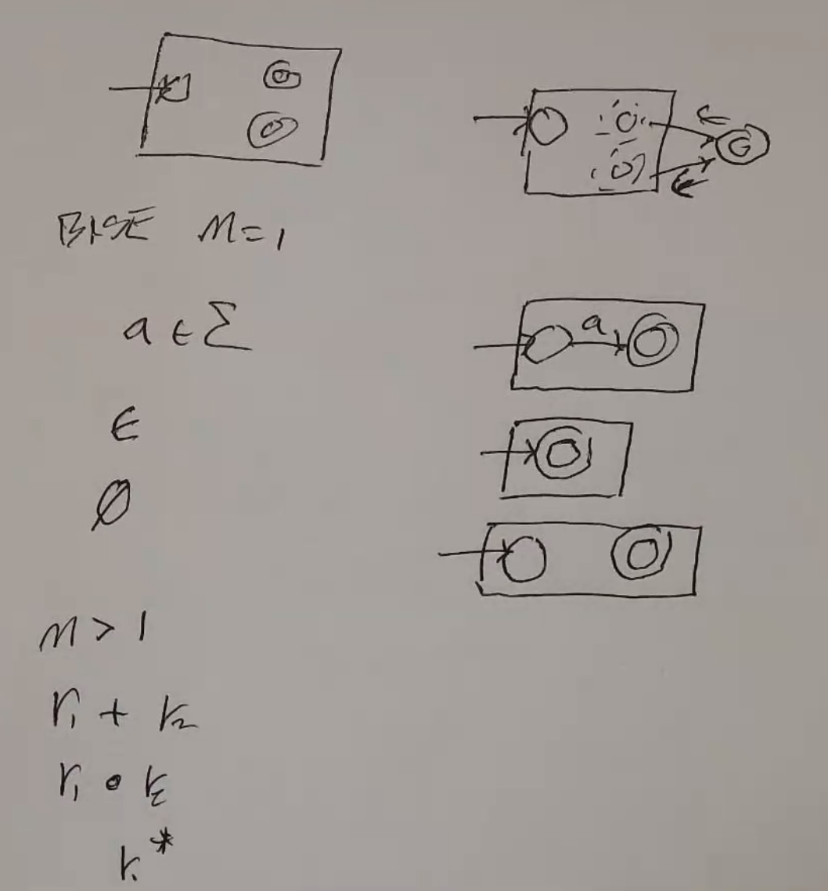

2. All regexes longer than length 1 are:
    - two smaller regexes with addition
    - two smaller regexes with concatenation
    - one smaller regex starred
3. IS: prove S(M) is true given that S(i) is true for all i < M.

- Case: :math:`r = r_1 + r_2`
    - since :math:`r_1, r_2` are smaller than *r*, there exists an :math:`\epsilon`-NFA with a single unique accept state for each. (IH)
    - Let these be :math:`M_1` and :math:`M_2`.
    - By adding a new start state, e-steps from that start state to the start states of of :math:`M_1` and :math:`M_2`, and e-steps from the accept states to a new unique accept state, it is possible to construct an :math:`\epsilon`-NFA to accept :math:`r_1 + r_2`.

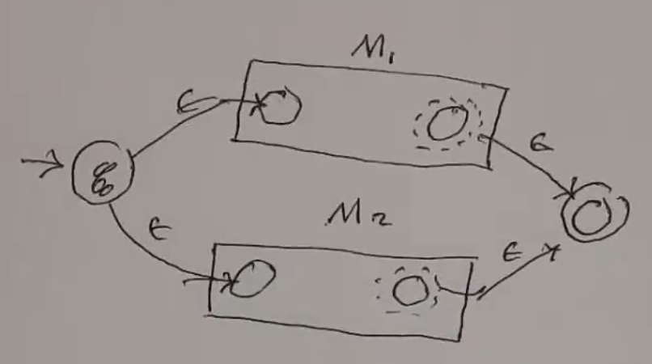

- Case: :math:`r = r_1 \cdot r_2` (concatenate)
    - since :math:`r_1, r_2` are smaller than *r*, there exists an :math:`\epsilon`-NFA with a single unique accept state for each. (IH)
    - Let these be :math:`M_1` and :math:`M_2`.
    - By adding an e-step from the accept state of M1 to the start state of M2, it is possible to construct an :math:`\epsilon`-NFA to accept :math:`r_1 + r_2`.

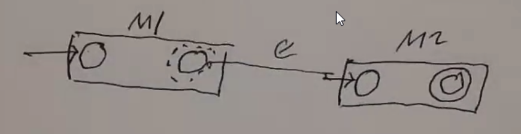

- Case: :math:`r = r_1*`
    - since :math:`r_1` is smaller than *r*, there exists an :math:`\epsilon`-NFA with a single unique accept state. (IH)
    - Let this be :math:`M_1`.
    - By adding an e-step from the old accept state to the old start state, from the old accept state to a new accept state, and the new start state to a new accept state.
    - QED.

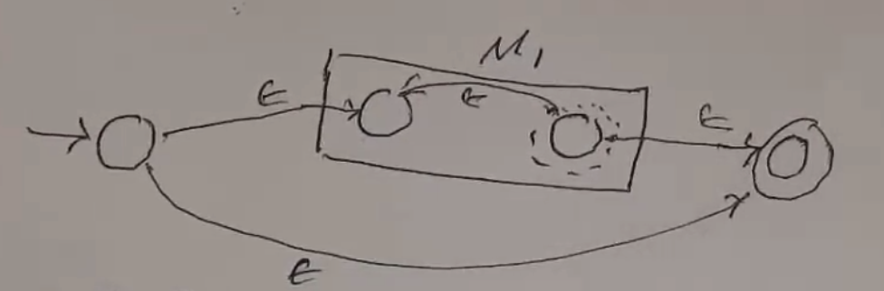

The Other Way Around
^^^^^^^^^^^^^^^^^^^^

**Thm**. Given a DFA, NFA, or e-NFA, there exists a regex that accepts the language of that FA.

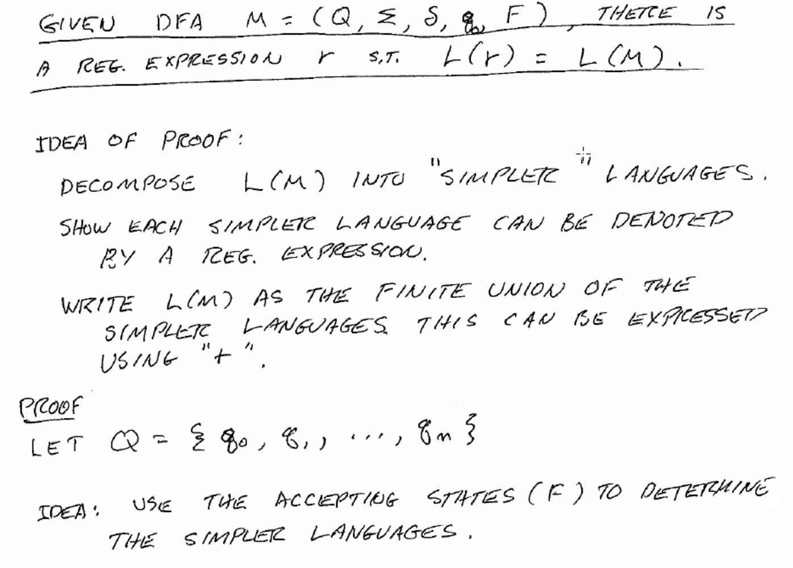

Define :math:`L_{ij}^k` as the set of strings that will move the DFA from :math:`q_i` to :math:`q_j`, where all
intermediate states' indices are < k.

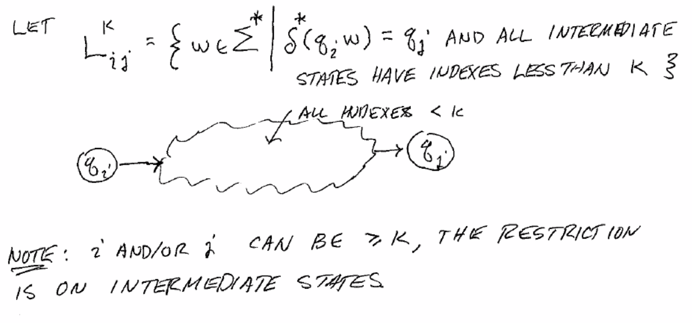

Now we can define L(M) as the union of all ways to get from :math:`q_0` to an accept state for each accept state:

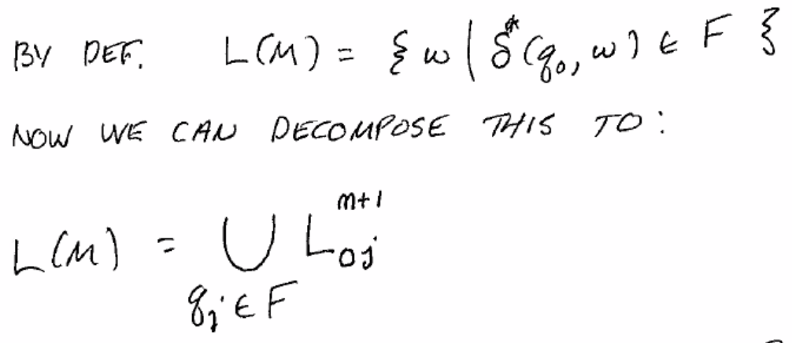

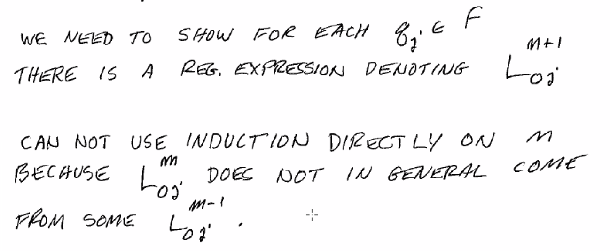

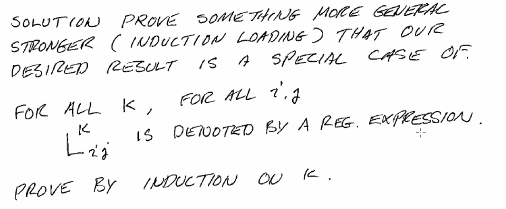

(Above: let's call this regex for :math:`L_{ij}^k` :math:`r_{ij}^k`)

The induction:

- base case. Since k = 0, this means only direct transitions:

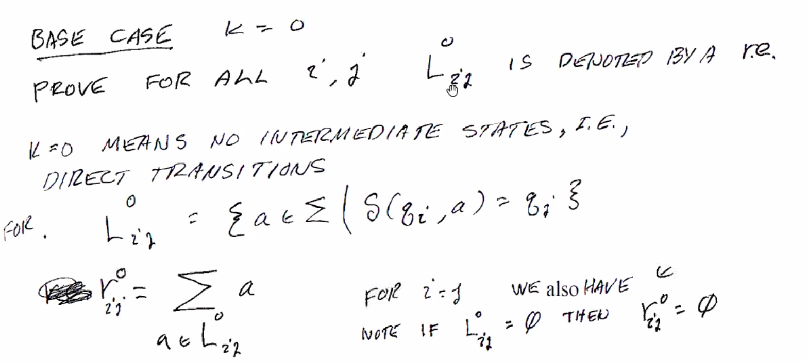

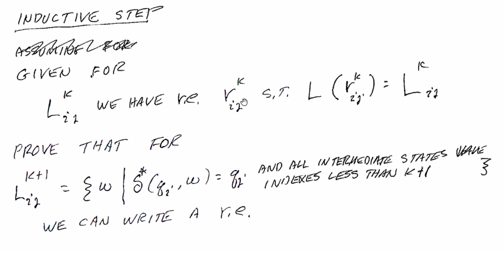

this produces two cases: if the path does not encounter k, or if it does:

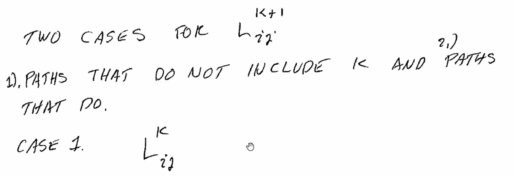

And if it does, it must have a first time it enters *k* and the last time it exits *k*, and anything in between
must be *k* to *k*, where all intermediate nodes are < k:

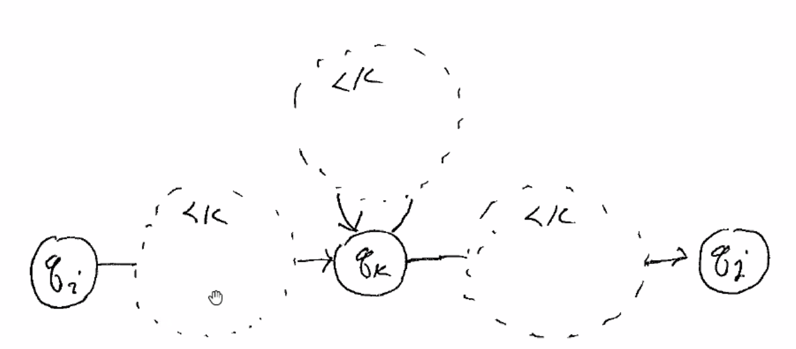

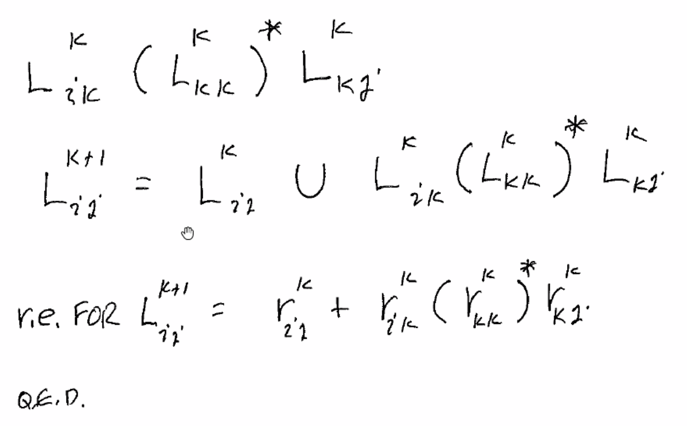

Now, we can expand this regex to:

:math:`\sum_{q_j \in F} r^k_{0j}`.

Example
^^^^^^^
(left axis: i, j; top axis: k)

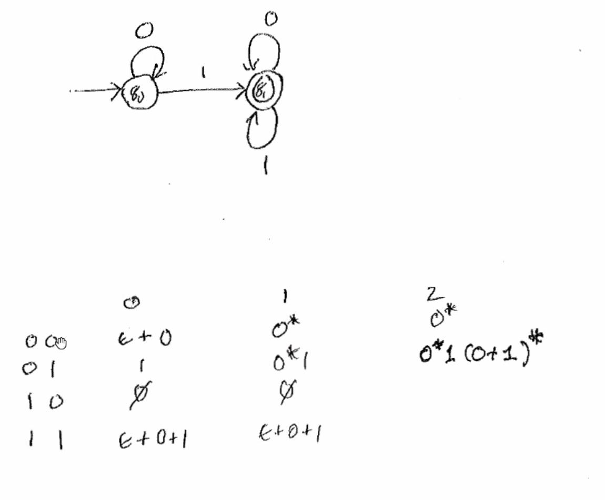

See published notes for full work.
