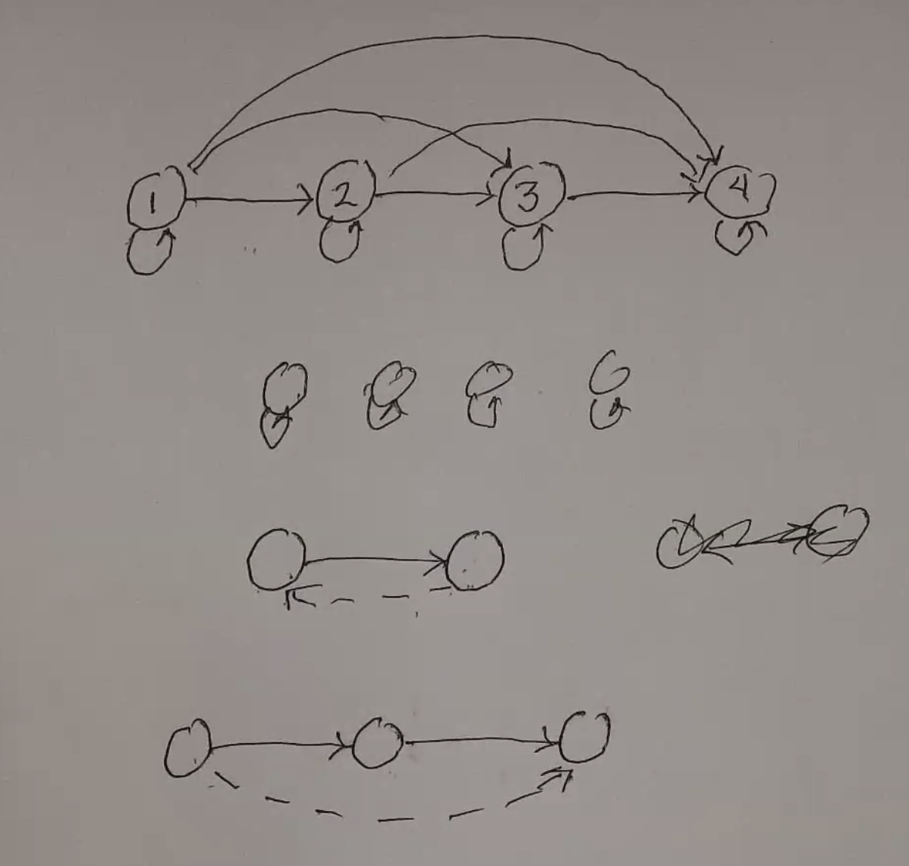

Sets
====

*10/5/2020 - 10/12/2020*

**Set**: A collection of distinguishable objects, with unordered, non-repeating elements

Two sets are equal if their elements are equal

Notation
--------

- :math:`z \in S` - element member
- :math:`S = \{1, 2, 3\}` - complete denotation
- :math:`\emptyset` - empty set
- :math:`Z` - integers
- :math:`R` - real numbers
- :math:`N` - natural numbers (no 0)
- :math:`Q` - rational numbers
- :math:`A \subseteq B` - all elements in A are in B (subset)
    - :math:`\forall x, x \in A \to x \in B`
- :math:`A \cap B` - all elements in A and B (intersection)
    - :math:`\{x: x \in A \land x \in B\}`
- :math:`A \cup B` - all elements in A or B (union)
    - :math:`\{x: x \in A \lor x \in B\}`
- :math:`A - B` - all elements in A but not B (difference)
    - :math:`\{x: x \in A \land x \notin B\}`
- :math:`A \Delta B` - all elements in exactly one set (symmetric difference)
    - :math:`\{x: x \in (A - B) \lor x \in (B - A) \}`

Given a universe of discourse :math:`\Omega`:

- :math:`\bar{A} = \Omega - A` - all elements not in A (complement)

Demorgan's Laws:

- :math:`\overline{A \cap B} = \bar{A} \cup \bar{B}`
- :math:`\overline{A \cup B} = \bar{A} \cap \bar{B}`

Definition:

- :math:`\{ x \in N | \frac{x}{2} \in N \}` - even number definition by restricted comprehension
- :math:`\{ x | P(x) \}` - unrestricted comprehension

**Power Set**: The set of all of a set's subsets

Russel's Paradox
----------------

**Extraordinary Sets**: All sets that include themselves as an element (ex. the set of everything that is not a teacup)

**Ordinary Sets**: All sets that don't have themselves as a member

Paradox: Does the set of all ordinary sets contain itself?

This is a paradox - which means that the set of all sets cannot exist

Relations
---------

Ex. :math:`<` - the set of all ordered pairs :math:`(a, b)` s.t. :math:`a < b`

- Cartesian product of 2 sets A, B: :math:`\{ (a, b) | a \in A \land b \in B \}`
    - e.g. :math:`\{c, d\} \times \{1, 2, 3\} = \{(c, 1), (c, 2), (c, 3), (d, 1), (d, 2), (d, 3)\}`

**Binary Relation**

A binary relation on A and B is defined by some subset of :math:`A \times B` - some examples of binary relations on
:math:`N \times N` are:

- :math:`=`: :math:`\{(1, 1), (2, 2), ...\}`
- :math:`<`: :math:`\{(1, 2), (1, 3), (2, 3), ...\}`

This can be denoted :math:`a < b \to (a, b) \in <`

Properties
^^^^^^^^^^

.. note::

    For this notation, the symbol :math:`\sim` represents an arbitrary relation. This can also be denoted :math:`R`,
    but that doesn't look good in LaTeX.

- Reflexive: :math:`x \sim x`
    - ex: =, <=
- Symmetric: :math:`x \sim y \implies y \sim x`
    - ex: =, but *not* < or <=
- Transitive: :math:`x \sim y \land y \sim z \implies x \sim z`
    - ex: =, <, <=
    - but not: :math:`\{ (x, y) | x, y \in N \land x = y - 1\}`

If a relation has all 3 properties, it is called an *equivalence relation*

Functions
---------
A function is a binary relation defined on the cross product of the domain and the codomain.

Given 2 sets A and B, a function :math:`f` is a binary relation on :math:`A \times B` s.t.
for all x in A, there exists exactly one y in B s.t. :math:`(x, y) \in f`

Notation: :math:`f: A \to B`

Graph
-----
An undirected graph can be represented as a tuple :math:`G = (V, E)` where V and E are sets (vertices, edges),
where :math:`E \subseteq \{\{x, y\} | x, y \in V \land x \neq y\}` (set of sets of two vertices)

A digraph is similar, but E must use ordered pairs rather than sets to indicate the direction of the edge, and
an edge can go to the same vertex. :math:`E \subseteq \{(x, y) | x, y \in V \times V\}`

Ex:

.. code-block:: text

    (1) --- (2)     V = {1, 2, 3}
     |              E = {{1, 2}, {1, 3}}
    (3)

.. code-block:: text

    (1) --> (2)     V = {1, 2, 3}
     ^              E = {(1, 2), (3, 1)}
    (3)

You can use digraphs to represent relations:

- Reflexive: every vertex has a self-loop
- Symmetric: all arrows must be bi-directional
- Transitive: the "jump" edge must exist (bottom of drawing)

Strings
-------

**Alphabet**: Any finite set (usually notated :math:`\Sigma`)

A string over :math:`\Sigma` is a finite length sequence of elements from :math:`\Sigma`

The *length* of a string x :math:`|x|` is the number of symbols in x

An *empty string* is a unique string of length 0, notated :math:`\epsilon`

A symbol with an exponent (e.g. :math:`a^x`) is repeated that many times

.. note::
    :math:`a^0 = \epsilon` and :math:`a^{m+1}=a^m a`

:math:`\Sigma^*` is the *set of all strings* over the alphabet :math:`\Sigma`

.. note::
    :math:`\emptyset^* = \{\epsilon\}`

Propositional Logic
-------------------

A *proposition* is a statement that is true or false.

**Connectives**

- not: :math:`\lnot`
- and: :math:`\land`
- or: :math:`\lor`
- implies: :math:`\implies`
- iff: :math:`\iff`

**Constants**

- 0, 1 (false, true)

**Variables**

- :math:`X = \{P, Q, R, ...\}`

Series of propositions/operations can be modeled using *truth tables* (which I am not going to write here, because
tables in RST suck)

**Tautology**: A proposition that is true in any given state of the universe

**Contradiction**: A proposition that is false in any given state of the universe

**Valid Argument**: The conjunction of all givens and the negation of the output is false in all states.

e.g. given the argument:

.. code-block:: text

    P -> Q
    P
    ---
    Q

:math:`(P \implies Q) \land P \land (\lnot Q)` is always false.

Useful Tautologies
^^^^^^^^^^^^^^^^^^

.. code-block:: text

    P -> Q      P -> Q      P -> Q      P or Q
    P           not Q       Q -> R      not P
    ---         ---         ---         ---
    Q           not P       P -> R      Q

                            P
    P           P and Q     Q
    ---         ---         ---
    P or Q      Q           P and Q

Cardinality
-----------

For finite sets, the *cardinality* of a set is the number of elements in the set.

Denoted, given a set A, :math:`|A|`. :math:`|\emptyset| = 0`

For infinite sets:

- countably infinite: all elements in the set can be put in a 1-to-1 correspondence with natural numbers, or a list of the elements can be generated
    - e.g. natural numbers (:math:`f(m) = m`)
    - even integers (:math:`f(m) = 2m`)
    - integers (:math:`f(m) = (-1)^m \lfloor \frac{m}{2} \rfloor`)
    - strings over the alphabet :math:`\{0, 1\}`
    - rational numbers (map :math:`N \times N` onto :math:`\frac{p}{q}` by making a list)
    - the union of any two countable sets
- uncountably infinite
    - e.g. real numbers (diagonalization)

.. note::

    Let's go back and look at :math:`\Sigma^*` - all strings over an alphabet.

    - :math:`\Sigma^*` is countably infinite, but
    - :math:`P(\Sigma^*)` is not!

    You can use diagonalization to prove that :math:`P(\Sigma^*)` is uncountably infinite using the same binary
    argument as real numbers - use 1 to indicate an element's presence in the subset, and 0 to indicate its not

