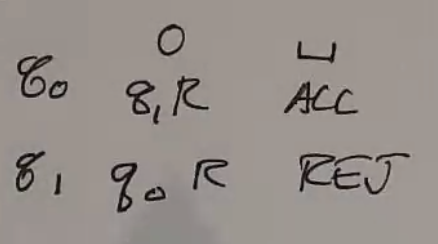

Turing Machines
===============
Related:

- Turing Machines
- Post systems
- mu-recursive functions
- lambda calc
- combinatory logic

Is it possible to write a program, that given the description of a machine M and an input for M, simulates
the execution of the machine on that input? (spoilers: yes, with TMs)

Definition
----------

- infinite tape
    - but input is finite, rest of tape is blank
- scanning head
    - can read cell from tape
    - can write to tape
- finite control
    - accept/reject
- tape alphabet
    - always includes a special blank symbol
- input alphabet
- transition function
    - inputs: (current state, symbol at head)
    - outputs: (new state, symbol to write, move l/r)
- stop in accept or reject state

.. image:: _static/tm1.png
    :width: 500

Formally:

.. image:: _static/tm2.png
    :width: 500

Examples
--------

Ex 1
^^^^
Even length strings of 0s:

.. image:: _static/tm3.png
    :width: 350

We can use some shorthand:

- If not changing states, omit new state
- If not writing, omit symbol to write

Ex 2
^^^^
Even # of 0s, ignore 1s

.. code-block:: text

    +----+------+---+-----+
    |    | 0    | 1 | e   |
    +----+------+---+-----+
    | q0 | q1 R | R | ACC |
    +----+------+---+-----+
    | q1 | q0 R | R | REJ |
    +----+------+---+-----+

Ex 3
^^^^
Add 1 to binary number

- :math:`\Sigma = \{0, 1\}`
- :math:`\Gamma = \{>, 0, 1\}`

Strategy: Move to the end of the tape, then go back and write 0s at each 1 until your carry is fine.

.. code-block:: text

    +----+-----+---------+-----+-------+
    |    | >   | 0       | 1   | e     |
    +====+=====+=========+=====+=======+
    | q0 | R   | R       | R   | q1, L |
    +----+-----+---------+-----+-------+
    | q1 | REJ | ACC 1 L | 0 L | REJ   |
    +----+-----+---------+-----+-------+