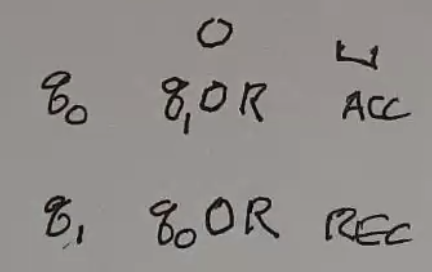

Turing Machines
===============
Related:

- Turing Machines
- Post systems
- mu-recursive functions
- lambda calc
- combinatory logic

Is it possible to write a program, that given the description of a machine M and an input for M, simulates
the execution of the machine on that input? (spoilers: yes, with TMs)

Definition
----------

- infinite tape
    - but input is finite, rest of tape is blank
- scanning head
    - can read cell from tape
    - can write to tape
- finite control
    - accept/reject
- tape alphabet
    - always includes a special blank symbol, and the input alphabet
- input alphabet
- transition function
    - inputs: (current state, symbol at head)
    - outputs: (new state, symbol to write, move l/r)
- stop in accept or reject state

Formally:

- :math:`M = (Q, \Sigma, \Gamma, \delta, q_0, q_{acc}, q_{rej})`

.. image:: _static/tm2.png
    :width: 500

You can notate the current state of the machine and tape like this:

Examples
--------

.. note::
    The symbol for "empty" on the tape below is notated ``e``.

Ex 1
^^^^
Even length strings of 0s:

We can use some shorthand:

- If not changing states, omit new state
- If not writing, omit symbol to write

.. tm4.png

.. code-block:: text

    +----+------+-------+
    |    | 0    | e     |
    +====+======+=======+
    | q0 | q1 R | ACC R |
    +----+------+-------+
    | q1 | q0 R | REJ r |
    +----+------+-------+

Alternatively, you can use a state diagram:

Ex 2
^^^^
Even # of 0s, ignore 1s

.. code-block:: text

    +----+------+---+-----+
    |    | 0    | 1 | e   |
    +----+------+---+-----+
    | q0 | q1 R | R | ACC |
    +----+------+---+-----+
    | q1 | q0 R | R | REJ |
    +----+------+---+-----+

Ex 3
^^^^
Add 1 to binary number

- :math:`\Sigma = \{0, 1\}`
- :math:`\Gamma = \{>, 0, 1\}`

Strategy: Move to the end of the tape, then go back and write 0s at each 1 until your carry is fine.

.. code-block:: text

    +----+-----+---------+-----+-------+
    |    | >   | 0       | 1   | e     |
    +====+=====+=========+=====+=======+
    | q0 | R   | R       | R   | q1, L |
    +----+-----+---------+-----+-------+
    | q1 | REJ | ACC 1 L | 0 L | REJ   |
    +----+-----+---------+-----+-------+

Ex 4
^^^^
Equal number of 0->1 transitions as 1->0 (assume string starts with 0)

.. code-block:: text

    +----+------+------+-----+
    |    | 0    | 1    | e   |
    +====+======+======+=====+
    | q0 | R    | q1 R | ACC |
    +----+------+------+-----+
    | q1 | q0 R | R    | REJ |
    +----+------+------+-----+

Ex 5
^^^^
:math:`0^n1^n`

.. image:: _static/tm6.png
    :width: 500

.. code-block:: text

    +----+--------+--------+------+------+-----+
    |    | 0      | 1      | X    | Y    | e   |
    +====+========+========+======+======+=====+
    | q0 | q1 X R | REJ    |      | q3 R |     |
    +----+--------+--------+------+------+-----+
    | q1 | R      | q2 Y L | REJ  | R    | REJ |
    +----+--------+--------+------+------+-----+
    | q2 | L      |        | q0 R | L    |     |
    +----+--------+--------+------+------+-----+
    | q3 | REJ    | REJ    | REJ  | R    | ACC |
    +----+--------+--------+------+------+-----+

Execution looks like this:

(con't)

.. image:: _static/tm8.png
    :width: 250

Ex 6
^^^^
Palindromes

- :math:`\Gamma = \{>, 0, 1, e\}`
- A string may look like ``>010e``.

.. code-block:: text

    +-----+--------+--------+-----+-------+
    |     | 0      | 1      | >   | e     |
    +=====+========+========+=====+=======+
    | s   | q0 > R | q1 > R | R   | ACC   |
    +-----+--------+--------+-----+-------+
    | q0  | R      | R      |     | q0' L |
    +-----+--------+--------+-----+-------+
    | q0' | q2 e L | REJ    | ACC |       |
    +-----+--------+--------+-----+-------+
    | q1  | R      | R      |     | q1' L |
    +-----+--------+--------+-----+-------+
    | q1' | REJ    | q2 e L | ACC |       |
    +-----+--------+--------+-----+-------+
    | q2  | L      | L      | s R |       |
    +-----+--------+--------+-----+-------+

Ex 7
^^^^
``w#w`` - the same string repeated twice with a divider (Sipser's approach)

Ex 8
^^^^
``ww`` - without the boundary

:math:`\Gamma = \{a, b, \dashv, à. á, \text{similar marks for b}\}`

- Scan L to R, counting symbols mod 2.
    - If not even, reject
- When reach end, put down an end marker :math:`\dashv`
- Then repeatedly scan left and right over tape
- When scanning R to L mark first unmarked a or b with á
- When scanning L to R mark first unmarked a or b with à
- Continue until all symbols of input are marked (finds middle of string)
- Repeatedly scan L to R
    - Remember and erase first à symbol
    - Check first á matches and erase
    - Reject if no match
- When all symbols erased, reject

..  _static/tm11.png

Variants
--------

Multi-Tape TM
^^^^^^^^^^^^^
E.g. 2 tapes

This is only just as powerful as a 1-tape TM:

.. image:: _static/tm13.png
    :width: 500
