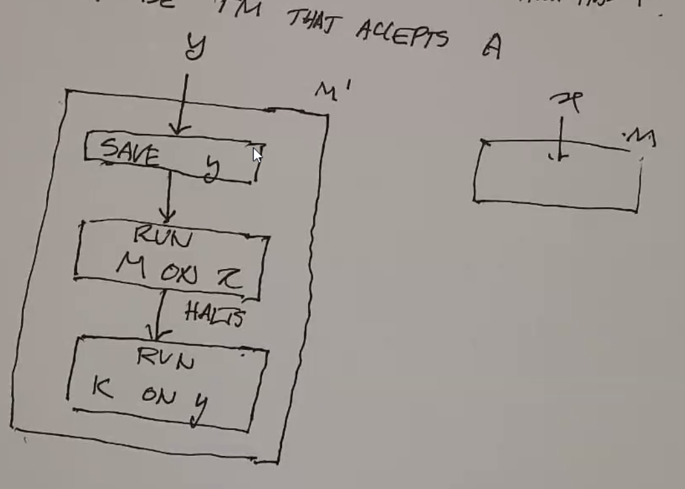

Turing Machines
===============
Related:

- Turing Machines
- Post systems
- mu-recursive functions
- lambda calc
- combinatory logic

Is it possible to write a program, that given the description of a machine M and an input for M, simulates
the execution of the machine on that input? (spoilers: yes, with TMs)

Definition
----------

- infinite tape
    - but input is finite, rest of tape is blank
- scanning head
    - can read cell from tape
    - can write to tape
- finite control
    - accept/reject
- tape alphabet
    - always includes a special blank symbol, and the input alphabet
- input alphabet
- transition function
    - inputs: (current state, symbol at head)
    - outputs: (new state, symbol to write, move l/r)
- stop in accept or reject state

.. image:: _static/tm1.png
    :width: 500

Formally:

- :math:`M = (Q, \Sigma, \Gamma, \delta, q_0, q_{acc}, q_{rej})`

You can notate the current state of the machine and tape like this:

.. image:: _static/tm2.5.png
    :width: 500

Examples
--------

.. note::
    The symbol for "empty" on the tape below is notated ``e``.

Ex 1
^^^^
Even length strings of 0s:

.. image:: _static/tm3.png
    :width: 350

We can use some shorthand:

- If not changing states, omit new state
- If not writing, omit symbol to write

.. tm4.png

.. code-block:: text

    +----+------+-------+
    |    | 0    | e     |
    +====+======+=======+
    | q0 | q1 R | ACC R |
    +----+------+-------+
    | q1 | q0 R | REJ r |
    +----+------+-------+

Alternatively, you can use a state diagram:

.. image:: _static/tm5.png
    :width: 500

Ex 2
^^^^
Even # of 0s, ignore 1s

.. code-block:: text

    +----+------+---+-----+
    |    | 0    | 1 | e   |
    +----+------+---+-----+
    | q0 | q1 R | R | ACC |
    +----+------+---+-----+
    | q1 | q0 R | R | REJ |
    +----+------+---+-----+

Ex 3
^^^^
Add 1 to binary number

- :math:`\Sigma = \{0, 1\}`
- :math:`\Gamma = \{>, 0, 1\}`

Strategy: Move to the end of the tape, then go back and write 0s at each 1 until your carry is fine.

.. code-block:: text

    +----+-----+---------+-----+-------+
    |    | >   | 0       | 1   | e     |
    +====+=====+=========+=====+=======+
    | q0 | R   | R       | R   | q1, L |
    +----+-----+---------+-----+-------+
    | q1 | REJ | ACC 1 L | 0 L | REJ   |
    +----+-----+---------+-----+-------+

Ex 4
^^^^
Equal number of 0->1 transitions as 1->0 (assume string starts with 0)

.. code-block:: text

    +----+------+------+-----+
    |    | 0    | 1    | e   |
    +====+======+======+=====+
    | q0 | R    | q1 R | ACC |
    +----+------+------+-----+
    | q1 | q0 R | R    | REJ |
    +----+------+------+-----+

Ex 5
^^^^
:math:`0^n1^n`

.. code-block:: text

    +----+--------+--------+------+------+-----+
    |    | 0      | 1      | X    | Y    | e   |
    +====+========+========+======+======+=====+
    | q0 | q1 X R | REJ    |      | q3 R |     |
    +----+--------+--------+------+------+-----+
    | q1 | R      | q2 Y L | REJ  | R    | REJ |
    +----+--------+--------+------+------+-----+
    | q2 | L      |        | q0 R | L    |     |
    +----+--------+--------+------+------+-----+
    | q3 | REJ    | REJ    | REJ  | R    | ACC |
    +----+--------+--------+------+------+-----+

Execution looks like this:

.. image:: _static/tm7.png
    :width: 250

(con't)

Ex 6
^^^^
Palindromes

- :math:`\Gamma = \{>, 0, 1, e\}`
- A string may look like ``>010e``.

.. code-block:: text

    +-----+--------+--------+-----+-------+
    |     | 0      | 1      | >   | e     |
    +=====+========+========+=====+=======+
    | s   | q0 > R | q1 > R | R   | ACC   |
    +-----+--------+--------+-----+-------+
    | q0  | R      | R      |     | q0' L |
    +-----+--------+--------+-----+-------+
    | q0' | q2 e L | REJ    | ACC |       |
    +-----+--------+--------+-----+-------+
    | q1  | R      | R      |     | q1' L |
    +-----+--------+--------+-----+-------+
    | q1' | REJ    | q2 e L | ACC |       |
    +-----+--------+--------+-----+-------+
    | q2  | L      | L      | s R |       |
    +-----+--------+--------+-----+-------+

Ex 7
^^^^
``w#w`` - the same string repeated twice with a divider (Sipser's approach)

.. image:: _static/tm9.png
    :width: 500

.. image:: _static/tm10.png
    :width: 500

Ex 8
^^^^
``ww`` - without the boundary

:math:`\Gamma = \{a, b, \dashv, à. á, \text{similar marks for b}\}`

- Scan L to R, counting symbols mod 2.
    - If not even, reject
- When reach end, put down an end marker :math:`\dashv`
- Then repeatedly scan left and right over tape
- When scanning R to L mark first unmarked a or b with á
- When scanning L to R mark first unmarked a or b with à
- Continue until all symbols of input are marked (finds middle of string)
- Repeatedly scan L to R
    - Remember and erase first à symbol
    - Check first á matches and erase
    - Reject if no match
- When all symbols erased, reject

..  static/tm11.png

Variants
--------

Multi-Tape TM
^^^^^^^^^^^^^
E.g. 2 tapes

.. image:: _static/tm12.png
    :width: 500

This is only just as powerful as a 1-tape TM:

Infinite Tape
^^^^^^^^^^^^^
Infinite left/right.

Universal TM
------------

Given:

- initial tape information
- the functional matrix for a TM

it is possible to simulate the operation of another TM.

1. scan symbol under read/write head
2. look up entry in function table for current state and the symbol read
    1. write second symbol of entry
    2. move r/w head according to 3rd symbol entry
    3. set current state to first symbol of entry
3. if current state acc or rej do so
4. goto 1

Special Coding
^^^^^^^^^^^^^^
Need way to distinguish between 3 kinds of symbols: L/R, input/tape alphabet, states

Maybe we can use binary:

Halting Problem
^^^^^^^^^^^^^^^
For any universal machine U, it acts the same way on a string as the machine it simulates. Is it possible
to make a universal machine that halts and rejects if the simulated machine loops?

No. No it is not. Use diagonalization:

Diagonalization Review
""""""""""""""""""""""
The real numbers are not countable.

- Assume R is countable
- So it is possible to write a list of R
- Consider a list of numbers (in this example, binary decimals):

- Given this, it is possible to define a real number that is not in the list:
    - the first digit is the opposite of the first position of the first number in the list
    - the second digit is the opposite of the second position of the second number
    - etc
- so the number must be different from all other numbers in the list
- which means it must not be able to make a list, so R cannot be countable.

Proof
"""""
- let *x* be a binary number
- let :math:`M_x` be the TM with the encoding *x*
- if *x* is not a valid TM encoding, :math:`M_x` halts
- consider the matrix, encoding whether each machine halts on a given input:

.. code-block:: text

    +-------+---+---+---+----+----+-----+----+-----+
    |       | e | 0 | 1 | 00 | 01 | 10  | 11 | ... |
    +=======+===+===+===+====+====+=====+====+=====+
    | M_e   | H | H | H | H  | H  | H   | H  |     |
    +-------+---+---+---+----+----+-----+----+-----+
    | M_0   |   |   |   |    |    |     |    |     |
    +-------+---+---+---+----+----+-----+----+-----+
    | M_1   |   |   |   |    |    |     |    |     |
    +-------+---+---+---+----+----+-----+----+-----+
    | M_00  |   |   |   |    |    |     |    |     |
    +-------+---+---+---+----+----+-----+----+-----+
    | M_01  |   |   |   |    |    |     |    |     |
    +-------+---+---+---+----+----+-----+----+-----+
    | ...   |   |   |   |    |    |     |    |     |
    +-------+---+---+---+----+----+-----+----+-----+
    | M_... | H | L | H | L  | L  | ... |    |     |
    +-------+---+---+---+----+----+-----+----+-----+

- Assume K exists that can determine, if given some machine M and string *x*, whether M halts on *x*
- Build N using K
    - On input *x*:
    - N applies K to :math:`M_x, x`
    - run K on :math:`M_x x`
    - if K accepts (i.e. :math:`M_x` halts), N loops
    - if K rejects, N accepts
    - (note: this is the diagonalization argument on the matrix above)
- So N is different on at least one given string for every :math:`M_x` in the table above
- So we have constructed an impossible machine, since it is not in the list of all possible machines above, so K cannot exist

Example
"""""""
.. code-block:: py

    m = 999
    while m > 1:
        if m % 2 == 0:
            m = m // 2
        else:
            m = 3 * m + 1

Is there any value of ``m`` such that this loop never halts? We don't know!

Reduction
---------

Ex. Halting Problem v. Membership Problem

- Left side: reducing the halting problem to the membership problem
- Right side: reducing the membership problem to the halting problem

You can use this to show that the membership problem is not solvable.

Rice's Theorem
--------------

For each of these, there is an algorithm that can solve these problems for finite automata:

However, these are not solvable for Turing Machines.

Definitions
^^^^^^^^^^^

- **Recursively Enumerable**: if :math:`S = L(M)` for some TM (i.e. TM doesn't loop)
- **Decidable**: a property is decidable if the set of strings with property is recursive
    - i.e. a total TM accepts strings with prop and rejects without prop

How do we find the set of all strings a TM accepts?

Thm
^^^
Any non-trivial property of a recursively enumerable set is undecidable.

Proof
^^^^^

- Let *p* be a non-trivial property of a recursively enumerable set such that:
    - :math:`P(A)` = T or F
    - :math:`P(\emptyset)` = F
- *p* is non-trivial :math:`\implies \exists A` a recursively enumerable set that has *p*
- let *K* be a TM that accepts A
- Let M and M' be defined as such:

- above: M halts on *x* :math:`\implies L(M') = A`
- M does not halt on *x* :math:`\implies L(M') = \emptyset`
- :math:`L(M') = A \implies P(L(M')) = P(A) = T`
- :math:`L(M') = \emptyset \implies P(L(M')) = P(\emptyset) = F`
- Reversing this, if we can decide the property, then we can tell if M halts on x.
- The halting problem is not solvable, so this problem is not solvable.

Conclusion
^^^^^^^^^^
:math:`\text{regular languages} \subset \text{CFLs} \subset \text{recursive} \subset \text{RE} \subset \Sigma^*`

There are a lot of languages that are not expressible by a TM! There are infinite subsets of :math:`\Sigma^*`!